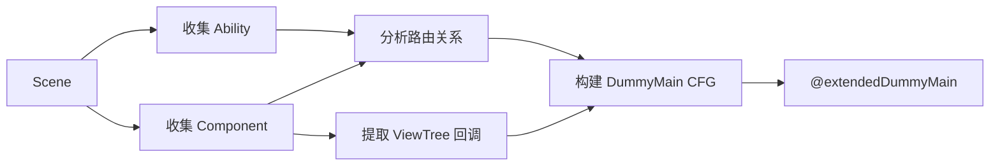

# TypeScript Lifecycle - 基于有界生命周期模型的 TypeScript 缺陷检测

> **基于 ArkAnalyzer 的扩展版生命周期建模 + 污点分析框架**
> 
> 本项目扩展了 ArkAnalyzer 的 `DummyMainCreater`，实现多 Ability 支持、精细化 UI 回调建模，并集成 IFDS 污点分析进行资源/闭包/内存泄漏检测。

[](https://github.com/kemoisuki/typescript_lifecycle)

---

## 📦 项目结构

```
typescript/
├── README.md                           # 本文件
├── arkanalyzer-master/
│   └── arkanalyzer-master/
│       ├── src/
│       │   ├── core/                   # ArkAnalyzer 核心
│       │   ├── callgraph/              # 调用图
│       │   └── TEST_lifecycle/         # ⭐ 生命周期建模 + 污点分析
│       │       ├── LifecycleTypes.ts
│       │       ├── AbilityCollector.ts
│       │       ├── NavigationAnalyzer.ts
│       │       ├── ViewTreeCallbackExtractor.ts
│       │       ├── LifecycleModelCreator.ts
│       │       ├── taint/              # 🆕 污点分析模块
│       │       │   ├── TaintFact.ts
│       │       │   ├── SourceSinkManager.ts
│       │       │   ├── TaintAnalysisProblem.ts
│       │       │   ├── TaintAnalysisSolver.ts
│       │       │   └── ResourceLeakDetector.ts
│       │       ├── cli/                # 工程化 CLI
│       │       │   ├── LifecycleAnalyzer.ts
│       │       │   └── ReportGenerator.ts
│       │       └── gui/                # Web 可视化
│       └── tests/unit/lifecycle/       # 测试用例
├── Demo4tests/                         # 真实 HarmonyOS 项目（验证用）
├── FlowDroid-develop/                  # FlowDroid 参考实现
└── 基于有界生命周期模型的TypeScript缺陷检测技术研究-fs.md
```

---

## 🎯 项目目标

本项目旨在扩展 ArkAnalyzer 的 DummyMain 机制，并在此基础上实现缺陷检测：

| 功能 | 原版 | 扩展版 |
|------|:----:|:------:|
| 多 Ability 支持 | ❌ | ✅ |
| 页面跳转建模 | ❌ | ✅ |
| 精细化 UI 回调 | ❌ | ✅ |
| ViewTree 整合 | ❌ | ✅ |
| 资源泄漏检测 | ❌ | ✅ |
| 闭包泄漏检测 | ❌ | ✅ |
| 内存泄漏检测 | ❌ | ✅ |
| IFDS 污点分析 | ❌ | ✅ |

---

## 🚀 快速开始

### 使用扩展版 DummyMain

```typescript
import { Scene } from './arkanalyzer-master/arkanalyzer-master/src/Scene';
import { LifecycleModelCreator } from './arkanalyzer-master/arkanalyzer-master/src/TEST_lifecycle';

// 1. 构建 Scene
const scene = new Scene();
scene.buildSceneFromProjectDir('/path/to/harmonyos/project');

// 2. 创建扩展版 DummyMain
const creator = new LifecycleModelCreator(scene);
creator.create();

// 3. 获取结果
const dummyMain = creator.getDummyMain();
const abilities = creator.getAbilities();
const components = creator.getComponents();

// 4. 运行污点分析
import { TaintAnalysisRunner } from './arkanalyzer-master/arkanalyzer-master/src/TEST_lifecycle/taint/TaintAnalysisSolver';

const runner = new TaintAnalysisRunner(scene);
const result = runner.runFromDummyMain();
console.log(`资源泄漏: ${result.resourceLeaks.length}, 污点泄漏: ${result.taintLeaks.length}`);
```

### 使用一站式分析器

```typescript
import { LifecycleAnalyzer } from './arkanalyzer-master/arkanalyzer-master/src/TEST_lifecycle/cli';

const analyzer = new LifecycleAnalyzer({
    generateDummyMain: true,
    detectResourceLeaks: true,
    runTaintAnalysis: true,
});
const result = await analyzer.analyze('/path/to/harmonyos/project');
```

---

## 📖 核心模块说明

### TEST_lifecycle 模块

| 文件/目录 | 功能 |
|------|------|
| `LifecycleTypes.ts` | 类型定义（Ability/Component 信息结构） |
| `AbilityCollector.ts` | 收集所有 Ability 和 Component，识别入口 |
| `NavigationAnalyzer.ts` | 路由分析（支持变量追踪和对象参数解析） |
| `ViewTreeCallbackExtractor.ts` | 从 ViewTree 提取 UI 回调 |
| `LifecycleModelCreator.ts` | 核心构建器，生成 DummyMain |
| `taint/TaintFact.ts` | 污点数据结构（AccessPath + SourceContext） |
| `taint/SourceSinkManager.ts` | 86 条 HarmonyOS Source/Sink 规则 |
| `taint/TaintAnalysisProblem.ts` | IFDS 问题定义（继承 DataflowProblem） |
| `taint/TaintAnalysisSolver.ts` | IFDS 求解器 + 分析运行器 |
| `taint/ResourceLeakDetector.ts` | 简化版方法内泄漏检测 |
| `cli/LifecycleAnalyzer.ts` | 一站式分析入口（生命周期 + 污点） |
| `cli/ReportGenerator.ts` | 多格式报告生成（JSON/HTML/Text/Markdown） |

### 关键技术点

```
┌─────────────────────────────────────────────────────────────┐
│ ① 路由参数解析 (extractRouterUrl)                           │
│    router.pushUrl(options) → 追踪变量 → 提取 url 字段       │
├─────────────────────────────────────────────────────────────┤
│ ② Want 对象解析 (extractWantTarget)                         │
│    startAbility(want) → 追踪变量 → 提取 abilityName 字段    │
├─────────────────────────────────────────────────────────────┤
│ ③ 入口识别 (checkIsEntryAbility)                            │
│    读取 module.json5 → 解析 mainElement → 确定入口 Ability  │
├─────────────────────────────────────────────────────────────┤
│ ④ 回调方法解析 (resolveCallbackMethod)                      │
│    onClick(handler) → 解析 MethodSig/FieldRef → ArkMethod  │
├─────────────────────────────────────────────────────────────┤
│ ⑤ 生命周期参数生成 (addMethodInvocation)                    │
│    onCreate() → 生成 new Want() → onCreate(want) 完整调用  │
├─────────────────────────────────────────────────────────────┤
│ ⑥ UI 回调参数生成 (addUICallbackInvocation)                 │
│    handleClick() → 生成 new ClickEvent() → handleClick(e)  │
└─────────────────────────────────────────────────────────────┘
```

### 工作流程



---

## 📚 详细文档

👉 **[查看完整文档](arkanalyzer-master/arkanalyzer-master/src/TEST_lifecycle/README.md)**

文档包含：
- 背景与动机
- 核心概念详解（Ability、Component、ViewTree）
- 模块架构图
- 完整流程解析（含图解）
- 类与函数详解
- 使用示例
- TODO 与扩展点
- 常见问题

---

## 🔧 TODO

### 已完成 ✅

**v1.0.0 - 生命周期建模**
- [x] NavigationAnalyzer 路由分析器
- [x] AbilityCollector 信息收集 + module.json5 入口识别
- [x] ViewTreeCallbackExtractor 精细化 UI 回调提取
- [x] LifecycleModelCreator 扩展版 DummyMain 生成
- [x] 4 个真实华为 Codelab 项目验证通过

**v2.0.0 - 污点分析**
- [x] TaintFact 数据结构（借鉴 FlowDroid）
- [x] SourceSinkManager（86 条 HarmonyOS 规则：资源/闭包/内存）
- [x] TaintAnalysisProblem（IFDS 问题定义）
- [x] TaintAnalysisSolver + TaintAnalysisRunner
- [x] ResourceLeakDetector 简化版方法内检测
- [x] LifecycleAnalyzer 一站式集成
- [x] 4 个真实项目污点分析验证

### 待完成
- [ ] **有界化约束实现**（逻辑组件/UI 事件/交互约束 - 项目核心创新点）
- [ ] **修复 DummyMain CFG 与 DataflowSolver 兼容性**
- [ ] NavPathStack 导航支持
- [ ] Lambda 完整支持

---

## 🧪 测试

### 测试结果

```
 Test Files  5 passed (5)
      Tests  90 passed (90)
   Duration  ~25s
```

### 测试覆盖

| 层级 | 测试内容 | 状态 |
|------|---------|:----:|
| L1 单元测试 | AbilityCollector, ViewTreeCallbackExtractor, NavigationAnalyzer | ✅ |
| L2 集成测试 | 模块间协作 | ✅ |
| L3 端到端测试 | 完整 DummyMain 生成 | ✅ |
| L4 复杂场景 | 多事件类型、嵌套组件 | ✅ |
| L5 边界情况 | 空组件、最小化 Ability | ✅ |
| L6 结构验证 | CFG 结构、参数生成 | ✅ |
| L7 性能测试 | 处理时间基准 (246ms) | ✅ |
| **L8 真实项目验证** | 4 个华为 Codelab 项目 | ✅ |
| **L9 污点分析单元测试** | TaintFact, SourceSinkManager, TaintAnalysisProblem | ✅ |
| **L10 污点分析集成测试** | TaintAnalysisSolver, TaintAnalysisRunner | ✅ |
| **L11 真实项目污点分析** | 4 个项目 Scene/DummyMain/Source/Sink 验证 | ✅ |

### 真实项目验证

| 项目 | 难度 | 类 | 方法 | Ability | Component | Source | Sink |
|------|:----:|---:|-----:|--------:|----------:|-------:|-----:|
| **RingtoneKit** | 初级 | 5 | 17 | 1 | 1 | 0 | 0 |
| **UIDesignKit** | 初级 | 14 | 52 | 1 | 3 | 0 | 0 |
| **CloudFoundationKit** | 中级 | 16 | 49 | 1 | 3 | 0 | 0 |
| **OxHornCampus** | 高级 | 82 | 244 | 1 | 17 | 9 | 1 |

### 运行测试

```bash
cd arkanalyzer-master/arkanalyzer-master
npm install                                          # 首次需要
npx vitest run tests/unit/lifecycle/ --reporter=verbose
```

详细测试说明见 `tests/resources/lifecycle/README.md`

---

## 👥 贡献者

- **YiZhou** - 项目负责人
- **AI Assistant** - 代码框架与文档

---

## 📅 更新日志

| 日期 | 版本 | 说明 |
|------|------|------|
| 2026-03-01 | v2.0.0 | **污点分析集成**：IFDS 求解器 + 86 条 Source/Sink 规则 + DummyMain 接入 + 4 个真实项目验证 |
| 2025-03-01 | v1.0.0 | **生命周期建模**：4 个真实华为 Codelab 项目验证通过，JSON5 解析修复 |
| 2025-02-10 | v0.9.0 | 增强动态路由参数解析，支持对象字面量 URL 提取 |
| 2025-02-06 | v0.8.0 | 扩展测试套件至 27 项，覆盖复杂场景和边界情况 |
| 2025-01-29 | v0.7.0 | 添加基础测试套件，17 项测试全部通过 |
| 2025-01-28 | v0.6.0 | 实现 addUICallbackInvocation() UI 回调参数生成 |
| 2025-01-28 | v0.5.0 | 实现 addMethodInvocation() 生命周期方法参数生成 |
| 2025-01-28 | v0.4.0 | 实现 resolveCallbackMethod() 回调方法解析 |
| 2025-01-27 | v0.3.0 | 完善路由参数解析和 module.json5 入口识别 |
| 2025-01-27 | v0.2.0 | 新增 NavigationAnalyzer 路由分析器 |
| 2025-01-17 | v0.1.0 | 初始框架完成，包含基本结构和文档 |

---

## 📄 许可证

本项目基于 Apache License 2.0 许可证。

---

> 如有问题，欢迎提 Issue 或 PR！
