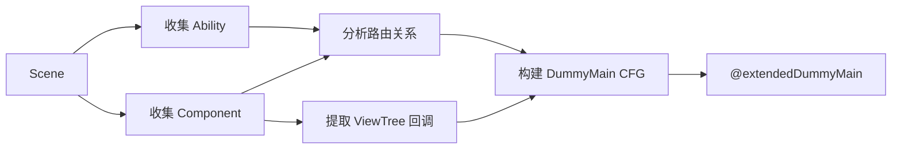

# TypeScript Lifecycle - 基于有界生命周期模型的 TypeScript 缺陷检测

> **基于 ArkAnalyzer 的扩展版生命周期建模 + 污点分析框架**
> 
> 本项目扩展了 ArkAnalyzer 的 `DummyMainCreater`，实现多 Ability 支持、精细化 UI 回调建模，并集成 IFDS 污点分析进行资源/闭包/内存泄漏检测。

[](https://github.com/kemoisuki/typescript_lifecycle)

---

## 📦 项目结构

```
typescript/
├── README.md                           # 本文件
├── arkanalyzer-master/
│   └── arkanalyzer-master/
│       ├── src/
│       │   ├── core/                   # ArkAnalyzer 核心
│       │   ├── callgraph/              # 调用图
│       │   └── TEST_lifecycle/         # ⭐ 生命周期建模 + 污点分析
│       │       ├── LifecycleTypes.ts
│       │       ├── AbilityCollector.ts
│       │       ├── NavigationAnalyzer.ts
│       │       ├── ViewTreeCallbackExtractor.ts
│       │       ├── LifecycleModelCreator.ts
│       │       ├── taint/              # 🆕 污点分析模块
│       │       │   ├── TaintFact.ts
│       │       │   ├── SourceSinkManager.ts
│       │       │   ├── SourceSinkLocationScanner.ts
│       │       │   ├── TaintAnalysisProblem.ts
│       │       │   ├── TaintAnalysisSolver.ts
│       │       │   └── ResourceLeakDetector.ts
│       │       ├── cli/                # 工程化 CLI
│       │       │   ├── LifecycleAnalyzer.ts
│       │       │   └── ReportGenerator.ts
│       │       └── gui/                # Web 可视化
│       ├── scripts/                    # 分析脚本（15/30/全量/两项目专项）
│       └── tests/unit/lifecycle/       # 测试用例
├── Demo4tests/                         # 真实 HarmonyOS 项目（验证用）
├── FlowDroid-develop/                  # FlowDroid 参考实现
└── 基于有界生命周期模型的TypeScript缺陷检测技术研究-fs.md
```

---

## 🎯 项目目标

本项目旨在扩展 ArkAnalyzer 的 DummyMain 机制，并在此基础上实现缺陷检测：

| 功能 | 原版 | 扩展版 |
|------|:----:|:------:|
| 多 Ability 支持 | ❌ | ✅ |
| 页面跳转建模 | ❌ | ✅ |
| 精细化 UI 回调 | ❌ | ✅ |
| ViewTree 整合 | ❌ | ✅ |
| 资源泄漏检测 | ❌ | ✅ |
| 闭包泄漏检测 | ❌ | ✅ |
| 内存泄漏检测 | ❌ | ✅ |
| IFDS 污点分析 | ❌ | ✅ |

---

## 🚀 快速开始

### 使用扩展版 DummyMain

```typescript
import { Scene } from './arkanalyzer-master/arkanalyzer-master/src/Scene';
import { LifecycleModelCreator } from './arkanalyzer-master/arkanalyzer-master/src/TEST_lifecycle';

// 1. 构建 Scene
const scene = new Scene();
scene.buildSceneFromProjectDir('/path/to/harmonyos/project');

// 2. 创建扩展版 DummyMain
const creator = new LifecycleModelCreator(scene);
creator.create();

// 3. 获取结果
const dummyMain = creator.getDummyMain();
const abilities = creator.getAbilities();
const components = creator.getComponents();

// 4. 运行污点分析
import { TaintAnalysisRunner } from './arkanalyzer-master/arkanalyzer-master/src/TEST_lifecycle/taint/TaintAnalysisSolver';

const runner = new TaintAnalysisRunner(scene);
const result = runner.runFromDummyMain();
console.log(`资源泄漏: ${result.resourceLeaks.length}, 污点泄漏: ${result.taintLeaks.length}`);
```

### 使用一站式分析器

```typescript
import { LifecycleAnalyzer } from './arkanalyzer-master/arkanalyzer-master/src/TEST_lifecycle/cli';

const analyzer = new LifecycleAnalyzer({
    generateDummyMain: true,
    detectResourceLeaks: true,
    runTaintAnalysis: true,
    // 有界约束（三条有界化约束均可调节）
    bounds: {
        maxCallbackIterations: 1,    // 约束2：DummyMain CFG 循环展开次数（默认 1 = DAG）
        maxAbilitiesPerFlow: 3,      // 约束1：单条数据流最多访问的 Ability 数
        maxNavigationHops: 5,        // 约束3：单条数据流最多经过的导航跳数
    },
});
const result = await analyzer.analyze('/path/to/harmonyos/project');
```

---

## 📖 核心模块说明

### TEST_lifecycle 模块

| 文件/目录 | 功能 |
|------|------|
| `LifecycleTypes.ts` | 类型定义（Ability/Component 信息结构） |
| `AbilityCollector.ts` | 收集所有 Ability 和 Component，识别入口 |
| `NavigationAnalyzer.ts` | 路由分析（支持 router/startAbility/NavPathStack 全覆盖） |
| `ViewTreeCallbackExtractor.ts` | 从 ViewTree 提取 UI 回调 |
| `LifecycleModelCreator.ts` | 核心构建器，生成 DummyMain |
| `taint/TaintFact.ts` | 污点数据结构（AccessPath + SourceContext） |
| `taint/SourceSinkManager.ts` | HarmonyOS Source/Sink 规则（含 fallback、ResultSet/AVPlayer/CommonEvent 等） |
| `taint/SourceSinkLocationScanner.ts` | Source/Sink 位置扫描（与污点分析配合） |
| `taint/TaintAnalysisProblem.ts` | IFDS 问题定义（继承 DataflowProblem） |
| `taint/TaintAnalysisSolver.ts` | IFDS 求解器 + 分析运行器 |
| `taint/ResourceLeakDetector.ts` | 简化版方法内泄漏检测 |
| `cli/LifecycleAnalyzer.ts` | 一站式分析入口（生命周期 + 污点） |
| `cli/ReportGenerator.ts` | 多格式报告生成（JSON/HTML/Text/Markdown） |

### 关键技术点

```
┌─────────────────────────────────────────────────────────────┐
│ ① 路由参数解析 (extractRouterUrl)                           │
│    router.pushUrl(options) → 追踪变量 → 提取 url 字段       │
├─────────────────────────────────────────────────────────────┤
│ ② Want 对象解析 (extractWantTarget)                         │
│    startAbility(want) → 追踪变量 → 提取 abilityName 字段    │
├─────────────────────────────────────────────────────────────┤
│ ③ 入口识别 (checkIsEntryAbility)                            │
│    读取 module.json5 → 解析 mainElement → 确定入口 Ability  │
├─────────────────────────────────────────────────────────────┤
│ ④ 回调方法解析 (resolveCallbackMethod)                      │
│    onClick(handler) → 解析 MethodSig/FieldRef → ArkMethod  │
├─────────────────────────────────────────────────────────────┤
│ ⑤ 生命周期参数生成 (addMethodInvocation)                    │
│    onCreate() → 生成 new Want() → onCreate(want) 完整调用  │
├─────────────────────────────────────────────────────────────┤
│ ⑥ UI 回调参数生成 (addUICallbackInvocation)                 │
│    handleClick() → 生成 new ClickEvent() → handleClick(e)  │
└─────────────────────────────────────────────────────────────┘
```

### 工作流程



---

## 📚 详细文档

👉 **[查看完整文档](arkanalyzer-master/arkanalyzer-master/src/TEST_lifecycle/README.md)**

文档包含：
- 背景与动机
- 核心概念详解（Ability、Component、ViewTree）
- 模块架构图
- 完整流程解析（含图解）
- 类与函数详解
- 使用示例
- TODO 与扩展点
- 常见问题
- **更新历程（完整）**：各修复点的**原因**与**修复历程**（cursor_typescript.md + 本仓库对话记录）

子模块文档：
- 污点分析技术细节与规则扩展：[taint/README.md](arkanalyzer-master/arkanalyzer-master/src/TEST_lifecycle/taint/README.md)
- CLI 与版本对应：[cli/README.md](arkanalyzer-master/arkanalyzer-master/src/TEST_lifecycle/cli/README.md)
- 测试说明与更新历程：[tests/unit/lifecycle/README.md](arkanalyzer-master/arkanalyzer-master/tests/unit/lifecycle/README.md)

---

## 📜 更新历程（摘要）

以下为与 **cursor_chats/cursor_typescript.md** 及本仓库对话记录一致的修复摘要；每条均可在子文档中找到**原因**与**修复历程**的详细描述。

| 阶段/版本 | 原因 | 修复要点 |
|-----------|------|----------|
| **首次修复（排序 1–5）** | 漏报：fs.open、getRdbStore 等未识别；误报：DummyMain 未含 aboutToDisappear。 | 扩展 Source/Sink 规则；DummyMain 加入 aboutToDisappear。 |
| **Fix 1–4** | resourceLeakCount 与 leakDetails 不一致；aboutToDisappear 内 clearInterval(this.xxx) 未配对；getRdbStore 别名未命中；setInterval 返回值未存储。 | 统计改为 taintAnalysisSummary.resourceLeaks.length；handleAssignmentSource/matchesAccessPathForArg/getExitToReturnFlowFunction 支持字段；getRdbStore.fallback；standalone setInterval → $setInterval_discarded。 |
| **阶段一** | 30 项目回归：getRdbStore、openSync 多种写法仍漏报。 | rdb.getRdbStore、openSync.fallback；OxHornCampus 断言 toBeGreaterThanOrEqual(1)。 |
| **阶段二** | aboutToDisappear 内已有 clear 仍误报，污点路径复杂。 | LifecycleLeakSuppressor：同组件 aboutToDisappear 含 clearInterval/clearTimeout 则过滤。 |
| **阶段四** | 入口执行顺序影响路径。 | abilities/components 按 isEntry 排序，EntryAbility / @Entry 优先。 |
| **阶段五** | LinysBrowser 分析栈溢出导致整轮中断。 | analyze 内 try-catch，buildErrorResult 降级并写入 errors；脚本处理 result.errors。 |
| **v2.2.0** | Map.set/Set.add/Array.push 作 Source 导致误报激增。 | 删除上述 7 条规则；规则键改为 id。 |
| **v2.3.0** | ViewTree 自引用 @Builder 导致 walkViewTree 无限递归；防抖“先 clear 再 set”误报；await fs.close 在 IR 为 ArkAssignStmt 未识别；ResultSet/AVPlayer/CommonEvent 缺规则；setTimeout 丢弃 ID 误报多。 | walkViewTree 增加 visited Set 破环；LifecycleLeakSuppressor 情形 3（BB 内/前驱 clear）；FileLeakSuppressor 识别 ArkAssignStmt 的 close；新增 queryDataSync/createAVPlayer.fallback/release.fallback/CommonEvent subscribe-unsubscribe；仅 setInterval 做“未存储即泄漏”。KeePassHO/LinysBrowser 可完整分析。 |

**完整更新历程**（含每条原因与修复历程）见 [TEST_lifecycle/README.md#更新历程完整](arkanalyzer-master/arkanalyzer-master/src/TEST_lifecycle/README.md#更新历程完整)。

---

## 🔧 TODO

### 已完成 ✅

**v1.0.0 - 生命周期建模**
- [x] NavigationAnalyzer 路由分析器
- [x] AbilityCollector 信息收集 + module.json5 入口识别
- [x] ViewTreeCallbackExtractor 精细化 UI 回调提取
- [x] LifecycleModelCreator 扩展版 DummyMain 生成
- [x] 4 个真实华为 Codelab 项目验证通过

**v2.0.0 - 污点分析**
- [x] TaintFact 数据结构（借鉴 FlowDroid）
- [x] SourceSinkManager（86 条 HarmonyOS 规则：资源/闭包/内存）
- [x] TaintAnalysisProblem（IFDS 问题定义）
- [x] TaintAnalysisSolver + TaintAnalysisRunner
- [x] ResourceLeakDetector 简化版方法内检测
- [x] LifecycleAnalyzer 一站式集成
- [x] 4 个真实项目污点分析验证

**v2.1.0 - 有界约束完整实现**
- [x] **约束1（Ability 数量限制）**：`checkAbilityBoundary` + `TaintFact.visitedAbilities` 跨 Ability 数据流截断
- [x] **约束2（UI 回调迭代次数）**：`LifecycleModelCreator` 循环展开 + `maxCallbackIterations` 全链路传递
- [x] **约束3（导航跳转次数）**：`isNavigationCall` + `TaintFact.navigationCount` 截断导航数据流
- [x] **NavPathStack 导航支持**：`pushPath` / `pushPathByName` / `replacePath` / `replacePathByName` 全覆盖
- [x] **SourceSinkManager Bug 修复**：相同 pattern 多条规则不再互相覆盖（key 改为 id）
- [x] **LifecycleAnalyzer.bounds 参数**：三条约束均可通过 `AnalysisOptions.bounds` 配置
- [x] 提升测试断言强度（有界/无界对比 + 泄漏内容验证 + 约束专项测试）

**v2.2.0 - 规则精度改进**
- [x] **删除超泛化 Source 规则**：移除 Map.set / Set.add / Array.push（消除 MultiVideo +85、OxHornCampus +6、TransitionBefore +6 误报）
- [x] **新增分布式 API 规则**：distributedDataObject.create / DataObject.on / DataObject.off
- [x] **新增 display 事件规则**：display.on / display.off（折叠屏事件泄漏支持）
- [x] **导航分析扩展到 Component**：Component 类中的 pushPath/pushPathByName 现已可被检测到

**v2.3.0 - ViewTree 环、防抖/File 抑制、规则扩展、KeePassHO/LinysBrowser**
- [x] **ViewTree 环检测**：walkViewTree 增加 visited Set，避免自引用 @Builder 导致栈溢出；KeePassHO、LinysBrowser 可完整分析
- [x] **防抖情形 3**：LifecycleLeakSuppressor 增加“source 所在 BB 内 source 前有 clear、或前驱 BB 含 clear 且不含 set”，抑制 ClipboardUtils、LoadingDialogUtils、linysTimeoutButton 等 FP
- [x] **File await close**：FileLeakSuppressor 识别 ArkAssignStmt 形式的 close/closeSync（如 await fs.close(fd)）
- [x] **Source/Sink 规则扩展**：RdbStore.queryDataSync、createAVPlayer.fallback、release.fallback、CommonEventManager.subscribe/unsubscribe
- [x] **ID 丢弃仅 setInterval**：仅对 setInterval 未存储返回值报泄漏，setTimeout 不报（减少 fire-and-forget 误报）
- [x] **15/30 项目对比与两项目专项**：Demo4tests 15 项目人工 vs 分析器验证报告；analyze-new-projects.ts、test-two-projects.ts；KeePassHO 3→0、LinysBrowser 7→2（保留 2 个 TP）
- [x] **更新历程文档**：根目录、TEST_lifecycle、taint、cli、tests/unit/lifecycle 各 README 补全更新历程（原因 + 修复历程）

### 待完成 / 已知局限

> **说明**：前三条已修复并划掉。下列为仍存在的局限；其中「跨方法 AVPlayer」「静态命名空间 className 丢失」在 v2.3.0 已有**部分缓解**（见各条说明），其余未修复。

- [x] ~~修复 DummyMain CFG 与 DataflowSolver 兼容性~~ (v2.0.1 已修复)
- [x] ~~NavPathStack 导航支持~~ (v2.1.0 已完成)
- [x] ~~有界化约束实现~~ (v2.1.0 已完成)
- [ ] **链式调用导航漏检**：`getUIContext().getRouter().pushUrl()` 需类型追溯，OxHornCampus 等项目漏检
- [ ] **跨方法资源泄漏漏检**：AVPlayer 跨 3 层方法追踪（MultiVideoApplication），IFDS 路径未闭合；v2.3.0 的 createAVPlayer.fallback 只解决 **className 为空时的 Source/Sink 识别**（如 Youtube-Music），未解决跨层路径闭合
- [ ] **静态命名空间 className 丢失**：v2.3.0 已对 **createAVPlayer/release** 用 fallback（仅方法名）**部分缓解**（如 Youtube-Music）；**distributedDataObject.create()** 等仍无 fallback，DistributedMail 等仍可能漏报
- [ ] **Promise 链内赋值**：getRdbStore 等在 `.then(db => { this.rdbStore = db })` 中赋值，IFDS 不建模异步，Accouting 等漏报
- [ ] **AppStorage/单例路径**：DummyMain 未覆盖 AvPlayerUtil.getInstance() 等，MultiVideo 漏报
- [ ] **事件驱动释放**：clearInterval 在 EventHub.on 回调内非 aboutToDisappear，ClashBox HHmmssTimer 等仍误报
- [ ] **静态字段传播**：clearTimeout(ClickUtil.throttleTimeoutID) 等静态字段污点未在 AccessPath 中追踪
- [ ] Lambda 完整支持

---

## 🧪 测试

### 测试结果

```
 Test Files  ~10 passed
      Tests  260+ passed
   Duration  ~30s (不含 Demo4tests 真实项目测试)
```

### 测试覆盖

| 层级 | 测试内容 | 状态 |
|------|---------|:----:|
| L1 单元测试 | AbilityCollector, ViewTreeCallbackExtractor, NavigationAnalyzer | ✅ |
| L2 集成测试 | 模块间协作 | ✅ |
| L3 端到端测试 | 完整 DummyMain 生成 | ✅ |
| L4 复杂场景 | 多事件类型、嵌套组件 | ✅ |
| L5 边界情况 | 空组件、最小化 Ability | ✅ |
| L6 结构验证 | CFG 结构、参数生成 | ✅ |
| L7 性能测试 | 处理时间基准 (246ms) | ✅ |
| **L8 真实项目验证** | 4 个华为 Codelab 项目 | ✅ |
| **L9 污点分析单元测试** | TaintFact, SourceSinkManager, TaintAnalysisProblem | ✅ |
| **L10 污点分析集成测试** | TaintAnalysisSolver, TaintAnalysisRunner | ✅ |
| **L11 真实项目污点分析** | 4 个项目 Scene/DummyMain/Source/Sink 验证 | ✅ |
| **L12 有界/无界对比测试** | OxHornCampus 有界约束效果验证 + 泄漏内容断言 | ✅ |
| **L13 约束专项测试** | 约束1/2/3 专项截断效果验证 | ✅ |
| **L14 Demo4tests 对比与验证** | 原始 vs 扩展对比（Demo4testsComparison）；15/30 项目人工 vs 分析器验证报告；KeePassHO/LinysBrowser 两项目专项 | ✅ |

### 真实项目验证

| 项目 | 难度 | 类 | 方法 | Source | Sink | IFDS 方法 | IFDS 事实 | 资源泄漏 |
|------|:----:|---:|-----:|-------:|-----:|----------:|----------:|--------:|
| **RingtoneKit** | 初级 | 10 | 32 | 0 | 0 | 19 | 169 | 0 |
| **UIDesignKit** | 初级 | 66 | 169 | 0 | 0 | 54 | 562 | 0 |
| **CloudFoundationKit** | 中级 | 16 | 49 | 0 | 0 | 22 | 184 | 0 |
| **OxHornCampus** | 高级 | 392 | 968 | 9 | 1 | 161 | 2644 | **1** |
| **KeePassHO** | 社区 | - | - | - | - | - | - | 0（修复后） |
| **LinysBrowser** | 社区 | - | - | - | - | - | - | 2（保留 TP，修复后） |

全量分析脚本：`arkanalyzer-master/arkanalyzer-master/scripts/analyze-new-projects.ts`；两项目专项：`scripts/test-two-projects.ts`。详见 [tests/unit/lifecycle/README.md](arkanalyzer-master/arkanalyzer-master/tests/unit/lifecycle/README.md)。

### 运行测试

```bash
cd arkanalyzer-master/arkanalyzer-master
npm install                                          # 首次需要
npx vitest run tests/unit/lifecycle/ --reporter=verbose
```

详细测试说明见 `tests/resources/lifecycle/README.md`

### 官方源码 vs 扩展框架 10 项目对比

若已将**官方 ArkAnalyzer 源码**（arkanalyzer-master-source）放在仓库根目录，可运行完整对比：

```bash
# 方式一：分步运行后汇总
cd arkanalyzer-master-source && npm install && npx vitest run tests/unit/benchmark/Demo4testsOriginalBenchmark
cd arkanalyzer-master/arkanalyzer-master && npx vitest run tests/unit/lifecycle/Demo4testsComparison
node tools/compare-original-extended.mjs

# 方式二：一键运行（自动执行上述步骤）
node tools/compare-original-extended.mjs --run-all
```

对比结果写入 `tools/comparison-results/`，并输出汇总表。扩展框架在 10 个 Demo4tests 项目上可检出资源泄漏，官方源码无泄漏检测功能。

---

## 👥 贡献者

- **YiZhou** - 项目负责人
- **AI Assistant** - 代码框架与文档

---

## 📅 更新日志

| 日期 | 版本 | 说明 |
|------|------|------|
| 2026-03-11 | v2.3.0 | **ViewTree 环、防抖/File 抑制、规则扩展**：walkViewTree 环检测（visited Set）；LifecycleLeakSuppressor 情形 3；FileLeakSuppressor 识别 ArkAssignStmt close；ResultSet/AVPlayer/CommonEvent 规则；ID 丢弃仅 setInterval；KeePassHO/LinysBrowser 可完整分析；各 README 更新历程（原因+修复历程） |
| 2026-03-07 | v2.2.0 | **规则精度改进**：删除 Map.set/Set.add/Array.push 超泛化规则（消除 MultiVideo 85个误报）+ 新增分布式 API / display 事件规则 + 导航分析扩展到 Component 类 |
| 2026-03-01 | v2.1.0 | **有界约束完整实现**：三条约束全链路接入 + NavPathStack 支持 + SourceSinkManager Bug 修复 + 测试断言强化 |
| 2026-03-01 | v2.0.1 | **修复 DummyMain CFG 兼容性** + AccessPath 参数错位，四个真实项目 IFDS 完整通过（OxHornCampus 检出 1 资源泄漏） |
| 2026-03-01 | v2.0.0 | **污点分析集成**：IFDS 求解器 + 86 条 Source/Sink 规则 + DummyMain 接入 + 4 个真实项目验证 |
| 2025-03-01 | v1.0.0 | **生命周期建模**：4 个真实华为 Codelab 项目验证通过，JSON5 解析修复 |
| 2025-02-10 | v0.9.0 | 增强动态路由参数解析，支持对象字面量 URL 提取 |
| 2025-02-06 | v0.8.0 | 扩展测试套件至 27 项，覆盖复杂场景和边界情况 |
| 2025-01-29 | v0.7.0 | 添加基础测试套件，17 项测试全部通过 |
| 2025-01-28 | v0.6.0 | 实现 addUICallbackInvocation() UI 回调参数生成 |
| 2025-01-28 | v0.5.0 | 实现 addMethodInvocation() 生命周期方法参数生成 |
| 2025-01-28 | v0.4.0 | 实现 resolveCallbackMethod() 回调方法解析 |
| 2025-01-27 | v0.3.0 | 完善路由参数解析和 module.json5 入口识别 |
| 2025-01-27 | v0.2.0 | 新增 NavigationAnalyzer 路由分析器 |
| 2025-01-17 | v0.1.0 | 初始框架完成，包含基本结构和文档 |

---

## 🔄 版本回滚

如需回滚到**当前最新提交**（2026-03-11 v2.3.0 更新历程与 KeePassHO/LinysBrowser 修复）的版本，可使用以下命令：

```bash
# 1. 查看当前最新提交的哈希（可选，用于确认）
git log -1 --oneline
# 输出示例: aa3dac8 docs & feat: v2.3.0 更新历程文档、ViewTree环检测、防抖/File抑制...

# 2. 回滚到该提交（保留工作区修改）
git checkout aa3dac8

# 3. 若需创建新分支并基于该版本开发
git checkout -b rollback-20260311 aa3dac8

# 4. 若需强制将 main 分支重置到该版本（慎用，会丢弃之后的提交）
git reset --hard aa3dac8
git push --force typescript_lifecycle main
```

| 场景 | 推荐命令 |
|------|----------|
| 仅本地查看该版本代码 | `git checkout aa3dac8` |
| 基于该版本开新分支开发 | `git checkout -b 新分支名 aa3dac8` |
| 完全丢弃之后提交并推送到远程 | `git reset --hard aa3dac8` + `git push --force` |

> ⚠️ `git push --force` 会覆盖远程历史，多人协作时请先与团队确认。

---

## 📄 许可证

本项目基于 Apache License 2.0 许可证。

---

> 如有问题，欢迎提 Issue 或 PR！
