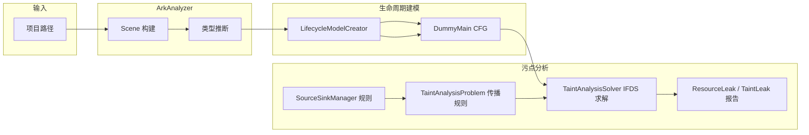
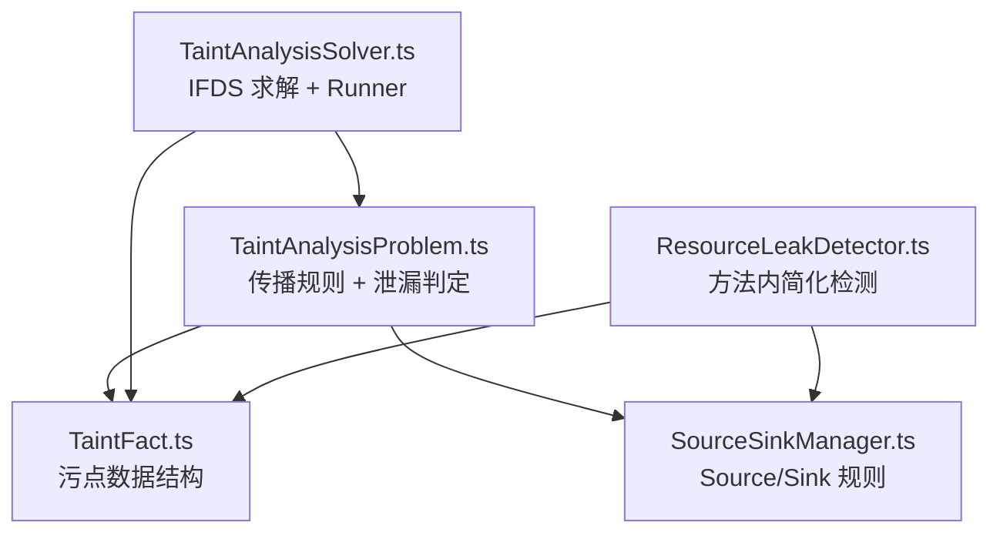
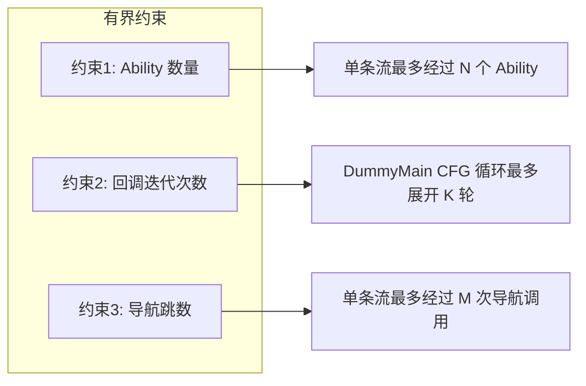

# 污点分析模块（taint/）技术说明

> 本目录实现基于有界生命周期模型的污点分析，用于检测 HarmonyOS 应用中的**资源泄漏**、**闭包泄漏**和**内存泄漏**。文档面向初学者，力求用通俗语言和图示说明各文件的作用与关系。

---

## 目录

1. [污点分析是什么？](#1-污点分析是什么)
2. [整体数据流与依赖关系](#2-整体数据流与依赖关系)
3. [各文件详解](#3-各文件详解)
4. [有界约束简介](#4-有界约束简介)
5. [实际例子：从代码到报告](#5-实际例子从代码到报告)
6. [如何扩展规则？](#6-如何扩展规则)

---

## 1. 污点分析是什么？

**一句话**：污点分析跟踪“敏感数据”从**产生点（Source）**到**消费点（Sink）**的流动；若某条路径上产生了数据却从未被正确“消费”（例如资源申请了却未释放），就报告为潜在泄漏。

在本项目中，“敏感数据”主要指：

- **资源**：如 `AVPlayer`、文件句柄、网络连接等，需要在不用时释放。
- **闭包**：如 `setInterval` 返回的定时器、事件监听回调，需要在组件销毁时清除。
- **内存**：如 `Worker` 线程、大块缓冲区，需要显式终止或释放。

**形象比喻**：  
Source 像“开水龙头”，Sink 像“关水龙头”。污点分析就是检查：在程序的所有执行路径上，每打开一个龙头，是否在合适的时机被关掉；若有路径只开不关，就记为泄漏。

```
┌─────────────────────────────────────────────────────────────────┐
│  代码中的一段逻辑                                                  │
│                                                                  │
│    let id = setInterval(() => { ... }, 1000);   ← Source（开龙头）  │
│    // ... 中间可能有很多分支 ...                                   │
│    clearInterval(id);                            ← Sink（关龙头）   │
│                                                                  │
│  若某条路径上没有 clearInterval，分析器会报告：资源 IntervalTimer   │
│  在申请后未被释放。                                                │
└─────────────────────────────────────────────────────────────────┘
```

---

## 2. 整体数据流与依赖关系

### 2.1 从“项目路径”到“泄漏报告”的流程



- **Scene**：整个项目的代码模型（类、方法、CFG 等）。
- **LifecycleModelCreator**：生成虚拟入口 **DummyMain**，把生命周期方法和 UI 回调串成一张“大图”（CFG）。
- **SourceSinkManager**：提供 Source/Sink 规则（哪些调用算“开龙头”、哪些算“关龙头”）。
- **TaintAnalysisProblem**：定义污点如何在赋值、方法调用、返回等语句上传播（以及有界约束）。
- **TaintAnalysisSolver**：以 DummyMain 为入口做 IFDS 求解，得到每条路径上的污点事实，并汇总成泄漏报告。

### 2.2 taint 目录内各文件的关系



- **TaintFact.ts**：定义“污点”长什么样（AccessPath、SourceContext、TaintFact 等），被 Problem 和 Solver 使用。
- **SourceSinkManager.ts**：只负责规则存储与匹配，被 Problem 和 ResourceLeakDetector 使用。
- **TaintAnalysisProblem.ts**：实现 `DataflowProblem<TaintFact>`，定义传播与泄漏判定逻辑。
- **TaintAnalysisSolver.ts**：继承 `DataflowSolver<TaintFact>`，驱动 IFDS 分析，并封装 **TaintAnalysisRunner**（构建 DummyMain + 调用 Solver）。
- **ResourceLeakDetector.ts**：不依赖 IFDS，仅在**单个方法内**做 Source/Sink 配对，用于快速筛查。

---

## 3. 各文件详解

### 3.1 TaintFact.ts — 污点数据结构

**角色**：定义“污点”的数学/程序表示，借鉴 FlowDroid 的 Abstraction / AccessPath / SourceContext。

**主要概念**：

| 概念 | 含义 | 通俗理解 |
|------|------|----------|
| **AccessPath** | 变量 + 可选字段路径 | 例如 `player` 或 `player.state`，表示“哪一块数据被污染了” |
| **SourceContext** | 污点从哪条语句产生 | 记录“是哪一个 Source 调用、在哪一行”，用于区分不同来源的污点 |
| **TaintFact** | 一条污点事实 | 由 AccessPath + SourceContext 组成；还带有 `visitedAbilities`、`navigationCount` 等有界约束字段 |

**为什么需要 SourceContext？**  
同一变量可能被多个 Source 污染（例如两个 `setInterval` 的返回值都赋给过 `timer`）。只有同时记录“来自哪条语句的 Source”，才能正确区分并在遇到对应 Sink 时只消除该条污点。

**简单例子**：

```typescript
// 代码：let timer = setInterval(cb, 1000);
// 分析器会为 timer 生成一条 TaintFact：
//   - accessPath: AccessPath(base=Local("timer"), fields=[])
//   - sourceContext: { stmt: <该 setInterval 调用对应的语句>, ... }
//   - category: 'closure'
//   - resourceType: 'IntervalTimer'
```

---

### 3.2 SourceSinkManager.ts — Source/Sink 规则管理

**角色**：维护“哪些方法调用算 Source、哪些算 Sink”，以及它们之间的配对关系（用于判断是否泄漏）。

**规则类型**：

- **Source**：产生污点的调用，如 `media.createAVPlayer()`、`setInterval()`、`distributedDataObject.create()`。
- **Sink**：消费/释放污点的调用，如 `AVPlayer.release()`、`clearInterval()`、`DataObject.off()`。

每条 Source 可指定 `pairedSinkId`，表示“若污点到达该 Sink，则视为已释放，不再报泄漏”。

**规则示例**（节选）：

| 类别 | Source 示例 | 配对 Sink | 说明 |
|------|-------------|-----------|------|
| 资源 | `media.createAVPlayer` | `AVPlayer.release` | 音视频播放器 |
| 闭包 | `setInterval` | `clearInterval` | 定时器 |
| 闭包 | `display.on` | `display.off` | 折叠屏事件 |
| 分布式 | `DataObject.on` | `DataObject.off` | 分布式对象监听 |

**使用方式**：  
其他模块不直接改规则表，而是通过 `SourceSinkManager#isSource(callInfo)` / `isSink(callInfo)` 查询某次方法调用是否为 Source 或 Sink，并拿到对应的 `SourceDefinition` / `SinkDefinition`（含 `resourceType`、`pairedSinkId` 等）。

**近期规则扩展（自上次推送）**：

| 新增/调整 | 用途 | 说明 |
|----------|------|------|
| `RdbStore.queryDataSync` | ResultSet 泄漏 | 同步查询返回结果集，配对 `ResultSet.close`，解决 JellyFin 等项目的漏报 |
| `createAVPlayer.fallback` | AVPlayer 创建 | 仅按方法名 `createAVPlayer` 匹配，解决 IR 中 className 为空时的漏报 |
| `release.fallback` | 媒体释放 | 仅按方法名 `release` + `requireTaintedThis: true`，覆盖 className 未知的 AVPlayer/AVRecorder |
| `CommonEventManager.subscribe` / `unsubscribe` | 订阅泄漏 | subscribe 污染第 0 个参数（subscriber），unsubscribe 为配对 Sink，用于 ohos_electron 等 |

---

### 3.3 结构性抑制（TaintAnalysisSolver.ts 内）

IFDS 求解后、返回报告前，会对 Timer 与 File 类泄漏做**结构性抑制**，以降低误报。

**LifecycleLeakSuppressor（Timer）**  
当泄漏类型为 `IntervalTimer` / `TimeoutTimer` 时，若满足下列任一情形则从报告中移除：

- **情形 1**：Source 所在方法的 CFG 中**直接语句**含 `clearTimeout`/`clearInterval`，且该方法基本块数 ≤ 2（纯顺序、无分支）。匹配简单 debounce。
- **情形 2**：Source 所在方法的**直接 callee** 仅含 clear 调用（不含 `setTimeout`/`setInterval`），且该 callee 基本块数 ≤ 3。匹配 throttle 中的 `clearExistingTimeout` 等纯清理 helper，避免误杀 MusicControlComponent 等 TP（其 lambda 内同时含 set 与 clear）。
- **情形 3（防抖 BB 前驱）**：  
  - 3a：Source 语句所在基本块内，在 source 之前存在 clear 调用（同块内「先 clear 后 set」）；或  
  - 3b：Source 所在块的所有**直接前驱**基本块中存在 clear 且不含 set（前驱作为 guard，如 `if(id) clearTimeout(id)`）。  
  这样可识别 `clearTimeout(id); id = setTimeout(...)` 的经典防抖写法，且不抑制 MusicHome TP（其 clear 在 else 分支，与 source 所在 if 分支为兄弟，非前驱）。

**FileLeakSuppressor（File）**  
当泄漏类型为 `File` 时，若 Source 所在方法（含其 callee 链）或同类的 lambda 子方法中存在 `closeSync`/`close` 调用，则抑制。  
此外，**关闭调用的识别**包含两类 IR 形态：

- **情形 A**：`ArkInvokeStmt`，即直接 `fs.close(fd)` 形式的语句。
- **情形 B**：`ArkAssignStmt`，且右侧为 `close`/`closeSync` 调用。因 `await fs.close(fd)` 在 ArkAnalyzer IR 中常被表示为赋值语句（右侧为 Promise 返回的调用），仅检查 ArkInvokeStmt 会漏检，故增加情形 B 以消除 KeePassHO Support.ets 等「跨 await 关闭」的误报。

---

### 3.4 TaintAnalysisProblem.ts — IFDS 问题定义与泄漏判定

**角色**：实现 `DataflowProblem<TaintFact>`，定义污点在控制流图上的传播规则，并在传播过程中记录“未到达配对 Sink 的 Source”，即资源/闭包泄漏。

**主要职责**：

1. **流函数**  
   为每类语句提供：
   - **getNormalFlowFunction**：普通语句（赋值、调用等）如何从前驱事实得到后继事实。
   - **getCallFlowFunction** / **getCallToReturnFlowFunction** / **getReturnFlowFunction**：方法调用与返回时的传播与汇总。

2. **Source 与 Sink 处理**  
   - 遇到 Source 调用：根据 `SourceSinkManager` 创建新的 `TaintFact` 并加入后继。
   - 遇到 Sink 调用：若污点到达配对 Sink，则从“未释放集合”中移除，不再报该条泄漏。

3. **有界约束**  
   - **约束 1**：单条数据流经过的 Ability 数量不超过 `maxAbilitiesPerFlow`（通过 `TaintFact.visitedAbilities` 与 `checkAbilityBoundary` 实现）。
   - **约束 3**：单条数据流经过的导航跳数不超过 `maxNavigationHops`（通过 `TaintFact.navigationCount` 与 `isNavigationCall` 实现）。

**泄漏判定**：  
在分析结束时，仍在“未释放集合”中的 Source 对应的污点，会生成 `ResourceLeak` 报告（包含 `resourceType`、`description`、`sourceStmt` 等）。

**ID 丢弃型 setInterval 检测**：  
当语句为 `ArkInvokeStmt`（即无赋值接收返回值）且该调用是 `setInterval` 时，会为该语句创建一条「丢弃 ID」污点（使用占位 AccessPath），并加入未释放集合。由于该 ID 从未被存储，`clearInterval` 无法消费它，故会一直留在集合中并被报告为泄漏。  
**仅对 setInterval 启用、不对 setTimeout 启用**：`setTimeout` 丢弃 ID 在业务代码中常见于 fire-and-forget（动画延迟、布局后执行等），多为一次性、低风险，若同样报告会导致误报激增；`setInterval` 丢弃 ID 会导致定时器永久运行，属于高置信度泄漏。

---

### 3.5 TaintAnalysisSolver.ts — IFDS 求解器与运行器

**角色**：

- **TaintAnalysisSolver**：继承 ArkAnalyzer 的 `DataflowSolver<TaintFact>`，用 IFDS 算法在整张调用图 + CFG 上求解污点事实。
- **TaintAnalysisRunner**：对外入口，负责“构建 DummyMain → 创建 Problem 与 Solver → 调用 solve → 汇总 ResourceLeak / TaintLeak / 统计信息”。

**与生命周期模型的衔接**：  
Runner 内部会调用 `LifecycleModelCreator` 生成 DummyMain 的 CFG，并把**约束 2**（`maxCallbackIterations`）通过配置传给 Creator，从而控制 DummyMain 中“循环展开”的轮数，影响 CFG 规模与分析精度/时间。

**输出**：  
`TaintAnalysisResult` 包含 `success`、`resourceLeaks`、`taintLeaks`、`statistics`（如 `analyzedMethods`、`totalFacts`）等，供 CLI/GUI 展示或写入报告。

---

### 3.6 ResourceLeakDetector.ts — 方法内简化检测

**角色**：不依赖 IFDS，仅在**单个方法内**扫描 Source 与 Sink，做简单配对。用于在完整污点分析之前做快速筛查，或在不启用 IFDS 时仍能给出方法内的泄漏提示。

**策略简述**：

1. 遍历方法内语句，用 `SourceSinkManager` 识别 Source 调用，记录“资源变量”。
2. 在同一方法内追踪该变量的使用，若发现配对 Sink（如 `clearInterval(id)`），则标记为已释放。
3. 方法结束时仍未释放的 Source，生成 `ResourceLeakReport`（含 `resourceType`、`sourceMethod`、`expectedSink` 等）。

**与 TaintAnalysisProblem 的区别**：  
Problem 是跨方法、跨 DummyMain 路径的完整污点分析；ResourceLeakDetector 只看当前方法，不处理跨方法传递和条件分支的复杂路径。

---

## 4. 有界约束简介

为避免分析规模爆炸，我们对“数据流”施加三条有界约束：



| 约束 | 参数名 | 含义 | 默认值 |
|------|--------|------|--------|
| 约束 1 | `maxAbilitiesPerFlow` | 一条污点流最多经过的 Ability 数量 | 3 |
| 约束 2 | `maxCallbackIterations` | DummyMain 中 UI 回调循环的展开轮数 | 1（CFG 为 DAG） |
| 约束 3 | `maxNavigationHops` | 一条污点流最多经过的导航调用次数 | 5 |

**配置方式**：  
通过 `LifecycleAnalyzer` 的 `options.bounds` 或 `TaintAnalysisRunner` 的 `config` 传入；Runner 再把约束 2 传给 `LifecycleModelCreator`，约束 1/3 在 `TaintAnalysisProblem` 中使用。

---

## 5. 实际例子：从代码到报告

**场景**：某页面的 `aboutToAppear` 里调用了 `setInterval`，但在部分路径上未调用 `clearInterval`（例如在 `aboutToDisappear` 里才清除，而分析时该路径被截断）。

**代码片段**（示意）：

```typescript
@Entry
@Component
struct Splash {
  private timer: number = 0;

  aboutToAppear() {
    this.timer = setInterval(() => { /* 轮播逻辑 */ }, 1000);
  }

  aboutToDisappear() {
    if (this.timer) clearInterval(this.timer);  // 若分析未覆盖到此处，会报泄漏
  }
}
```

**分析过程简述**：

1. **SourceSinkManager**：识别 `setInterval` 为 Source（`resourceType: 'IntervalTimer'`），`clearInterval` 为配对 Sink。
2. **TaintAnalysisProblem**：在 DummyMain 的 CFG 上从 `aboutToAppear` 的 `setInterval` 产生 TaintFact，沿控制流传播；若某条路径未到达 `clearInterval`（例如因约束 2 未展开到 `aboutToDisappear`），该污点会留在“未释放集合”。
3. **TaintAnalysisSolver**：汇总所有路径，得到 `resourceLeaks` 列表。
4. **报告**：一条 `ResourceLeak`，例如 `resourceType: 'IntervalTimer'`，`description: '资源 IntervalTimer 在申请后未被释放。应调用 clearInterval 进行释放'`。

---

## 6. 如何扩展规则？

若要支持新的 HarmonyOS API（例如新的“开/关”配对）：

1. 在 **SourceSinkManager.ts** 的 `HARMONYOS_SOURCES` 中追加一条 `SourceDefinition`（`id`、`methodPattern`、`category`、`resourceType`、`pairedSinkId` 等）。
2. 若有配对 Sink，在 `HARMONYOS_SINKS` 中追加一条 `SinkDefinition`，并保证 `pairedSourceId` 与 Source 的 `id` 一致。
3. 规则键使用 **id**（而非 methodPattern），避免同一种方法名对应多条规则时互相覆盖。

**注意**：  
- 静态命名空间调用（如 `distributedDataObject.create()`）在部分场景下可能被解析为“空类名”，导致规则需按实际 IR 类名/方法名调整或接受当前工具局限。  
- 链式调用（如 `getUIContext().getRouter().pushUrl()`）的导航识别、跨多方法边界的 AVPlayer 释放等，属于已知局限，见主 README 的“已知问题”。

---

## 7. 更新历程（污点相关，含原因与修复历程）


### 7.1 Source/Sink 规则扩展（SourceSinkManager.ts）

| 阶段 | 原因 | 修复历程 |
|------|------|----------|
| 首次（排序1–3） | Accouting、interview 等 getRdbStore/fs.open 漏报；规则仅按 className.methodName 精确匹配，别名或不同 import 未覆盖。 | 新增 `dataRdb.getRdbStore`、`fileIo.open`、`fileIo.openSync` 及配对 Sink；补充单元测试。 |
| Fix 3 | `import rdb from '@ohos.data.relationalStore'` 后 `rdb.getRdbStore()` 的 className 非 dataRdb，未命中。 | 新增 `getRdbStore.fallback`，仅按方法名 `getRdbStore` 匹配。 |
| 阶段一（30 项目） | 15→30 项目后仍有 getRdbStore、openSync 多种写法漏识别。 | 新增 `rdb.getRdbStore`；新增 `openSync.fallback`（methodPattern: 'openSync'），不限制 className，避免误匹配 dialog.open 故未加 open.fallback。 |
| v2.2.0 | Map.set、Set.add、Array.push 当作 Source 导致 sources 激增、误报率高。 | 删除上述 7 条规则及配对 Sink；规则存储键改为 id，避免同 pattern 多条互相覆盖。 |
| 本轮 | JellyFin queryDataSync 返回 ResultSet 未识别；Youtube-Music createAVPlayer 在 IR 中 className 为空；ohos_electron CommonEvent subscribe/unsubscribe 无规则。 | 新增 `RdbStore.queryDataSync`（methodPattern: 'queryDataSync'，resourceType: ResultSet）；新增 `createAVPlayer.fallback`（methodPattern: 'createAVPlayer'）、`release.fallback`（requireTaintedThis: true）；新增 `CommonEventManager.subscribe`（taintedParamIndices: [0]）、`CommonEventManager.unsubscribe`（requiredTaintedParamIndices: [0]）。 |

### 7.2 aboutToDisappear 与 Timer 误报抑制（TaintAnalysisSolver.ts — LifecycleLeakSuppressor）

| 阶段 | 原因 | 修复历程 |
|------|------|----------|
| 阶段二 | BootView、Splash、Connect、Request 等在同组件 aboutToDisappear 中已有 clearInterval，污点传播路径复杂，直接改 IFDS 成本高。 | 新增 `LifecycleLeakSuppressor`：对 IntervalTimer/TimeoutTimer 泄漏，若 sourceStmt 所属类存在 aboutToDisappear，且该方法或其递归 callee 中含 clearInterval/clearTimeout（`methodContainsTimerRelease`），则过滤该条泄漏。在 `runFromDummyMain` 中于 `getResourceLeaks()` 之后调用 `filterSuppressedTimerLeaks`。 |
| harmony-utils / throttle（情形1、2） | ClickUtil、SpinKitPage、HarmonyUtilCode throttle 等“同方法或 callee 内 clearTimeout”仍被报泄漏；仅 aboutToDisappear 抑制不足。 | 在 `isOneShotTimerPattern` 中增加：**情形1** 同方法直接语句含 clear 且 CFG blockCount≤2；**情形2** 直接 callee 仅含 clear、不含 set，且 callee blockCount≤3（匹配 throttle 的 clearExistingTimeout；MusicControlComponent 的 lambda 含 setInterval 故不满足“仅含 clear”，保留 MusicHome TP）。 |
| 本轮（情形3） | ClipboardUtils、LoadingDialogUtils:148、linysTimeoutButton、linysExpandableCardItem 等“先 clear 再 set”的防抖写法，clear 与 set 在同一方法内但 blockCount>2 或 clear 在前驱 BB。 | **情形3**：定位 source stmt 所在 BasicBlock；3a）同块内在 source 之前存在 clear 则抑制；3b）对 source 块的每个 `getPredecessors()` 块，若含 clear 且不含 set 则抑制。新增 `isTimerSourceInvoke` 判断 set 调用，避免误杀 TP。 |

### 7.3 File 误报抑制（TaintAnalysisSolver.ts — FileLeakSuppressor）

| 阶段 | 原因 | 修复历程 |
|------|------|----------|
| 已有实现 | harmony-utils FileUtil、Gramony 等同方法/同 try 内 openSync+closeSync，或 lambda 内 close，需在报告前过滤。 | `FileLeakSuppressor`：对 File 类型泄漏，若 source 所在方法（含 callee 链）或同类 lambda 子方法中存在 closeSync/close，则过滤。`isFileCloseInvoke` 原只检查 `ArkInvokeStmt`。 |
| 本轮 | KeePassHO Support.ets 中 `await fs.close(destFile.fd)` 在 IR 中为 `ArkAssignStmt`（右值为 close 调用），未识别为释放。 | 在 `isFileCloseInvoke` 中增加对 `ArkAssignStmt` 的右操作数取方法名，若为 close/closeSync 则视为释放调用。 |

### 7.4 setInterval 返回值未存储（TaintAnalysisProblem.ts）

| 阶段 | 原因 | 修复历程 |
|------|------|----------|
| Fix 4 | TrainsTrack.ets:196、EntryAbility.ets:135 等 `setInterval(...)` 未赋值给变量，永远无法 clear，属真实泄漏。 | 在 getNormalFlowFunction 与 getCallToReturnFlowFunction 的零事实处理中，对 `ArkInvokeStmt` 且 `callInfo.methodName === 'setInterval'` 创建 `$setInterval_discarded` 污点并加入 activeTaints。 |
| 本轮（不包含 setTimeout） | 若对 setTimeout 同样处理，会命中大量 fire-and-forget（动画、布局延迟等），误报激增；setInterval 丢弃 ID 必为持续泄漏，故仅对 setInterval 做“未存储即泄漏”。 | 保持仅对 `setInterval` 的 ArkInvokeStmt 创建丢弃 ID 污点；setTimeout 不加入该逻辑。 |

### 7.5 污点传播与统计（TaintAnalysisProblem / LifecycleAnalyzer）

| 项目 | 原因 | 修复历程 |
|------|------|----------|
| resourceLeakCount 与 leakDetails 不一致 | 统计来自 resourceLeakResult.summary.totalLeaks，与 taint 的 leakDetails 不同源。 | LifecycleAnalyzer 中当存在 taintAnalysisSummary 时，resourceLeakCount 改为 `taintAnalysisSummary.resourceLeaks.length`。 |
| aboutToDisappear 污点配对（Fix 2） | 跨方法字段污点未正确传入 aboutToDisappear 或从 aboutToDisappear 回传，clearInterval(this.xxx) 无法 kill。 | handleAssignmentSource 支持 `this.xxx = setInterval()`；matchesAccessPathForArg 支持字段参数；getExitToReturnFlowFunction 中 this→receiver 污点回传。 |

---

## 附录：与主模块的衔接

- **LifecycleModelCreator**：由 **TaintAnalysisRunner** 调用，用于生成 DummyMain 的 CFG；Runner 通过配置传入 `maxCallbackIterations`。
- **LifecycleAnalyzer**（cli）：在“一站式分析”中创建 **TaintAnalysisRunner**，并传入 `bounds`（三条约束），最后将 `resourceLeaks` / `taintLeaks` 写入分析结果与报告。

更完整的模块划分与使用方式见 [../README.md](../README.md)。
