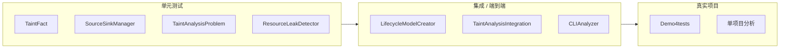
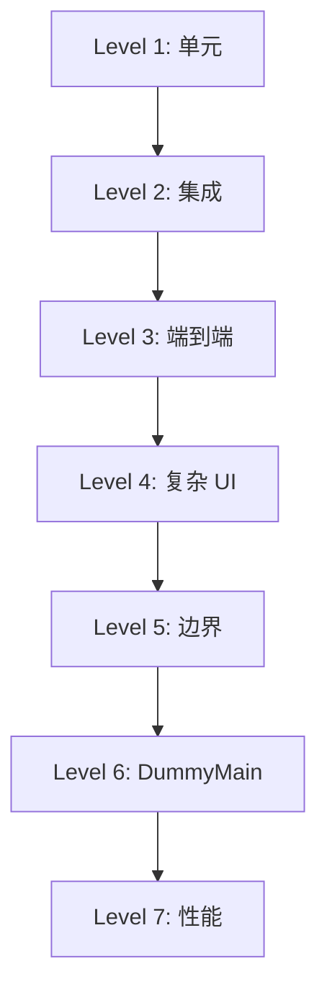
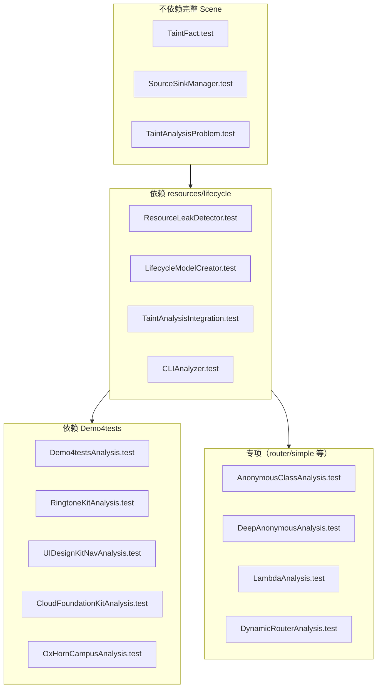
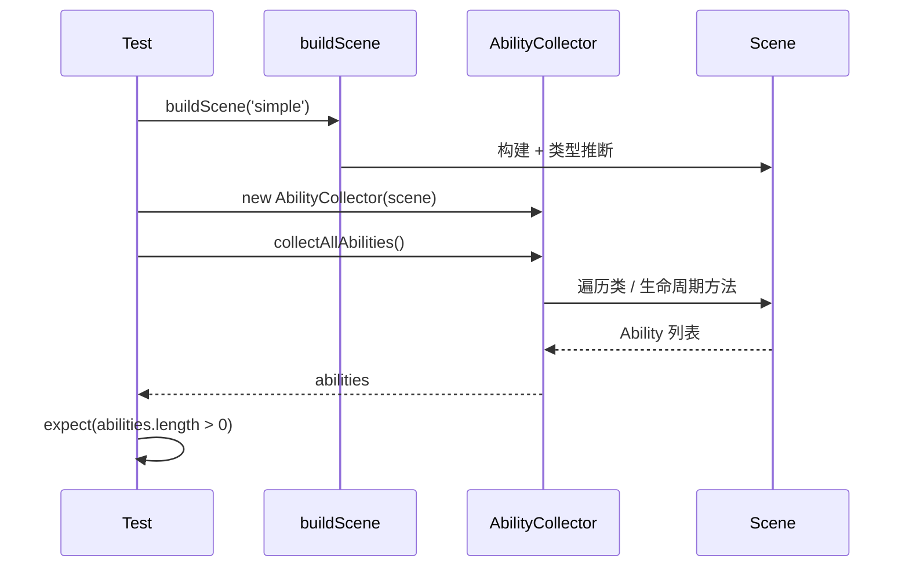

# Lifecycle 单元测试说明

本文档介绍 `tests/unit/lifecycle` 目录下各测试文件的目的、依赖关系及运行方式，面向初学者和后续维护者。

---

## 1. 概述

本目录包含 **TEST_lifecycle** 模块的完整测试套件，覆盖从「单类/单方法」的单元测试，到「多模块协作」的集成测试，再到「真实鸿蒙项目」的端到端分析。测试框架为 **Vitest**。



- **单元测试**：不依赖完整 ArkAnalyzer Scene，用 Mock 或小资源项目验证单个类/接口。
- **集成测试**：依赖 Scene 和 `tests/resources/lifecycle` 下的小项目，验证多模块协作与完整流水线。
- **真实项目测试**：依赖 `Demo4tests` 目录下的真实鸿蒙工程，验证实际代码上的分析效果与已知泄漏检出。

---

## 2. 测试文件一览

| 文件名 | 类型 | 主要测试目的 |
|--------|------|----------------|
| **TaintFact.test.ts** | 单元 | AccessPath、TaintFact、SourceContext 等污点事实与访问路径 |
| **SourceSinkManager.test.ts** | 单元 | Source/Sink 规则加载、匹配（HARMONYOS_SOURCES/SINKS） |
| **TaintAnalysisProblem.test.ts** | 单元 | FlowFunction 概念、与 TaintFact/SourceSinkManager 的集成概念（因循环依赖用独立实现验证） |
| **ResourceLeakDetector.test.ts** | 单元/集成 | 资源泄漏检测器行为及与 LifecycleAnalyzer 的集成 |
| **LifecycleModelCreator.test.ts** | 集成/端到端 | 多层级：AbilityCollector、ViewTreeCallbackExtractor、NavigationAnalyzer → 集成 → E2E → 复杂 UI/边界/DummyMain/性能 |
| **TaintAnalysisIntegration.test.ts** | 集成 | 完整 Scene 下 TaintAnalysisProblem、Solver、SourceSinkManager、有界约束等 |
| **CLIAnalyzer.test.ts** | 集成 | CLI 工具：LifecycleAnalyzer、ReportGenerator，输出与统计 |
| **Demo4testsAnalysis.test.ts** | 端到端 | 对 7 个真实项目跑完整流水线（含 IFDS、有界 k=1/k=2、已知泄漏断言） |
| **RingtoneKitAnalysis.test.ts** | 单项目 | RingtoneKit_Codelab_Demo 上的 lifecycle 分析 |
| **UIDesignKitNavAnalysis.test.ts** | 单项目 | UIDesignKit_HdsNavigation 多页面导航、NavPathStack |
| **CloudFoundationKitAnalysis.test.ts** | 单项目 | CloudFoundationKit 预取、NavPathStack、module.json5 解析 |
| **OxHornCampusAnalysis.test.ts** | 单项目 | OxHornCampus 大规模项目、生命周期与手势回调 |
| **AnonymousClassAnalysis.test.ts** | 专项 | 匿名类（%AC）结构、URL 等在 ArkAnalyzer 中的表示 |
| **DeepAnonymousAnalysis.test.ts** | 专项 | 匿名类深度分析（字段、方法、CFG） |
| **LambdaAnalysis.test.ts** | 专项 | Lambda/箭头函数在 ArkAnalyzer 中的转换与解析 |
| **DynamicRouterAnalysis.test.ts** | 专项 | NavigationAnalyzer 对动态路由/URL 的提取与追踪 |

---

## 3. 各测试文件说明

### 3.1 污点分析单元测试（不依赖完整 Scene）

#### TaintFact.test.ts

- **目的**：验证污点分析的基础数据结构，避免与 ArkAnalyzer 的循环依赖，使用 Mock 的 Local、FieldSignature、Stmt。
- **主要内容**：
  - **AccessPath**：本地变量与字段的访问路径（如 `x`、`x.a.b`）的创建、相等性、哈希。
  - **TaintFact**：污点事实的创建、零事实、Source 与 Sink 事实、传播规则。
  - **SourceContext / SourceDefinition**：源点的上下文与定义。
- **示例**：例如验证 `TaintFact.fromSource(sourceDef, stmt)` 能正确生成带行号的污点事实，以及 `AccessPath.appendField(field)` 能生成 `x.field` 这样的路径。

#### SourceSinkManager.test.ts

- **目的**：验证 HarmonyOS 资源相关的 Source/Sink 规则是否被正确加载与匹配。
- **主要内容**：
  - 默认规则加载（`getSourceCount` / `getSinkCount`）。
  - 常见 API 的匹配：如 `media.createAVPlayer` 为 Source、`AVPlayer.release` 为 Sink；`fs.open` / `fs.close` 等。
  - 按 `MethodCallInfo`（className + methodName）判断是否为 Source/Sink。
- **示例**：`manager.isSource({ className: 'media', methodName: 'createAVPlayer' })` 应返回对应的 SourceDefinition。

#### TaintAnalysisProblem.test.ts

- **目的**：因无法在 Vitest 中直接导入 TaintAnalysisProblem（循环依赖），改为测试 FlowFunction 接口的独立实现，以及 TaintFact 与 SourceSinkManager 的集成概念。
- **主要内容**：
  - **KillAllFlowFunction**：返回空集。
  - **IdentityFlowFunction**：返回原事实集合。
  - **GenFlowFunction**：在原有基础上增加新事实。
  - 与 TaintFact、SourceSinkManager 配合的概念性验证。
- **说明**：TaintAnalysisProblem 的完整行为在 **TaintAnalysisIntegration.test.ts** 中验证。

#### ResourceLeakDetector.test.ts

- **目的**：验证资源泄漏检测器在 Scene 上的基本行为及其与 LifecycleAnalyzer 的集成。
- **依赖**：`tests/resources/lifecycle/simple`、Scene 构建。
- **主要内容**：
  - 创建 ResourceLeakDetector 实例、获取 SourceSinkManager。
  - 在真实 Scene 上运行检测、泄漏报告格式与数量。
  - 与 LifecycleAnalyzer 的集成（若存在相关用例）。

---

### 3.2 生命周期模型与流水线（依赖 Scene + resources/lifecycle）

#### LifecycleModelCreator.test.ts

- **目的**：分层验证从「单组件收集」到「完整 DummyMain 生成」的整条流水线。
- **依赖**：`tests/resources/lifecycle`（如 `simple`、`router` 等）。
- **层级概览**：



- **Level 1**：AbilityCollector（收集 Ability/Component、生命周期方法）、ViewTreeCallbackExtractor（UI 回调）、NavigationAnalyzer（路由/URL）。
- **Level 2**：模块间协作（例如 Collector + Extractor 一起用）。
- **Level 3**：端到端 LifecycleModelCreator，对 whole 项目跑通并检查结果结构。
- **Level 4**：复杂 UI 场景。
- **Level 5**：边界情况（空项目、异常结构等）。
- **Level 6**：DummyMain 结构（入口、调用关系）。
- **Level 7**：简单性能基准（如 246ms 阈值）。
- **示例**：Level 1 中对 `simple` 项目执行 `collector.collectAllAbilities()`，断言至少有一个 Ability 且包含 `onCreate` 等生命周期方法。

#### TaintAnalysisIntegration.test.ts

- **目的**：在完整 ArkAnalyzer 环境下验证污点分析全链路（Scene 先初始化以解决循环依赖）。
- **依赖**：`tests/resources/lifecycle`、Scene、Sdk。
- **主要内容**：
  - Scene 构建后，TaintAnalysisProblem、TaintAnalysisSolver（IFDS）能正常创建与运行。
  - SourceSinkManager 的闭包/内存等规则在真实 IR 上的效果。
  - LifecycleAnalyzer 与污点分析的集成。
  - 有界约束（k=1/k=2）的专项验证。
- **示例**：对 `simple` 构建 Scene，创建 TaintAnalysisProblem 并运行 Solver，断言产生的污点事实数量或泄漏报告符合预期。

#### CLIAnalyzer.test.ts

- **目的**：验证对外暴露的 CLI 工具行为。
- **依赖**：`tests/resources/lifecycle/simple`、输出目录 `tests/output/cli-test`。
- **主要内容**：
  - **LifecycleAnalyzer**：`analyze(projectPath)` 成功、项目名/路径正确、统计信息（文件数、类数）、Ability/Component 收集、导航与 DummyMain 生成选项。
  - **ReportGenerator**：报告生成、输出文件存在、内容格式（如 HTML/JSON）。
- **示例**：对 `simple` 调用 `analyzer.analyze(TEST_PROJECT_PATH)`，断言 `analysisResult.project.name === 'simple'` 且 `summary.totalFiles > 0`。

---

### 3.3 真实项目测试（依赖 Demo4tests）

以下四个文件分别针对一个真实鸿蒙项目，验证 TEST_lifecycle 在该项目上的表现；**Demo4testsAnalysis.test.ts** 则对 7 个项目统一跑完整流水线并做更强断言。

| 文件 | 项目 | 侧重点 |
|------|------|--------|
| **RingtoneKitAnalysis.test.ts** | RingtoneKit_Codelab_Demo | 基础 lifecycle、Ability/Component 收集 |
| **UIDesignKitNavAnalysis.test.ts** | UIDesignKit_HdsNavigation_Codelab | 多页面、NavPathStack、复杂 UI 回调 |
| **CloudFoundationKitAnalysis.test.ts** | CloudFoundationKit_Codelab_Prefetch_ArkTS | 预取、NavPathStack、module.json5（尾随逗号） |
| **OxHornCampusAnalysis.test.ts** | OxHornCampus | 大规模、完整生命周期、多页面、手势回调 |

- **Demo4testsAnalysis.test.ts**（核心端到端）：
  - 对 7 个 Demo4tests 子项目依次执行**完整分析流程**（Scene → Ability/Component → 导航 → DummyMain → Source/Sink 扫描 → IFDS）。
  - **OxHornCampus**：断言能精确检出已知的 1 处资源泄漏（如 AVPlayer/IntervalTimer 未释放）；并做**有界约束对比**（k=1 vs k=2 下 IFDS 事实数减少）。
  - 其他项目：DistributedMail、TransitionPerformanceIssue、MultiVideoApplication 等，验证流程可跑通、无崩溃、基本统计合理。
- **依赖关系**：单项目测试与 Demo4testsAnalysis 都依赖 `Demo4tests` 目录存在；Demo4testsAnalysis 还依赖完整 IFDS 与 DummyMain 流水线，是「最重」的一组测试。

---

### 3.4 专项分析测试（匿名类、Lambda、动态路由）

这些测试不侧重「通过/失败」的严格断言，而是帮助理解 ArkAnalyzer 对特定语言结构的表示，以及 NavigationAnalyzer 的能力边界。

#### AnonymousClassAnalysis.test.ts

- **目的**：看 ArkAnalyzer 中匿名类（对象字面量）如何表示，以及 URL 等值在匿名类中的存储方式。
- **依赖**：`tests/resources/lifecycle/router`。
- **内容**：列出所有类（含 `%AC` 匿名类）、分析匿名类结构（字段、方法）、与路由参数的对应关系。
- **示例**：找到 `%AC1$DynamicRouter.goToPage1` 这类名字，查看其字段和方法，理解「点击跳转」在 IR 中的形态。

#### DeepAnonymousAnalysis.test.ts

- **目的**：对指定匿名类（如 `%AC1$DynamicRouter.goToPage1`）做更细粒度分析。
- **内容**：字段、初始值、方法签名、CFG/IR 语句、父类与接口。
- **用途**：调试「匿名类里的 URL 如何被 NavigationAnalyzer 读到」时很有用。

#### LambdaAnalysis.test.ts

- **目的**：分析 ArkAnalyzer 如何把 Lambda/箭头函数转换为类和方法（如 `%AM` 或带 `$` 的方法名）。
- **依赖**：`tests/resources/lifecycle/simple`、ViewTreeCallbackExtractor。
- **内容**：列出 Index 等组件的所有方法、标记 Lambda 生成的方法、与 ViewTree 回调的对应关系。
- **示例**：`onClick(() => { ... })` 可能对应一个生成的 `%AM...` 方法，测试会打印并帮助理解这类映射。

#### DynamicRouterAnalysis.test.ts

- **目的**：验证 NavigationAnalyzer 对动态 URL、路由参数的提取与追踪能力。
- **依赖**：`tests/resources/lifecycle/router`、NavigationAnalyzer。
- **内容**：对 Index、DynamicRouter 等类分析路由相关方法、提取 URL 列表、检查带参数的路径是否被正确识别。
- **示例**：如 `/page1?id=1` 或 `pathByName('Detail', { id: x })` 这类动态路由是否出现在分析结果中。

---

## 4. 依赖关系示意



- **单元（TaintFact / SourceSinkManager / TaintAnalysisProblem）**：只依赖 Mock 或纯 taint 模块，运行最快、最稳定。
- **集成（ResourceLeakDetector / LifecycleModelCreator / TaintAnalysisIntegration / CLIAnalyzer）**：依赖 Scene 和 `tests/resources/lifecycle`，需要本地有 Sdk 和资源项目。
- **真实项目**：依赖 `Demo4tests` 路径与目录结构，若未克隆或路径变化，可只跑前两类测试。
- **专项**：依赖 `router` 或 `simple` 等小项目，用于理解和调试匿名类、Lambda、动态路由，不要求 Demo4tests。

---

## 5. 简单示例：两条典型测试链

### 5.1 一个测试在做什么？（以 LifecycleModelCreator 为例）

初学者常问：「一个 `it()` 到底在测什么？」下面用 **LifecycleModelCreator.test.ts** 里的一条用例说明。

**代码片段（简化）：**

```ts
it('1.1.1 应该能收集到 Ability', () => {
    const abilities = collector.collectAllAbilities();
    expect(abilities.length).toBeGreaterThan(0);
});
```

**含义**：对资源项目 `simple` 建好 Scene 后，用 **AbilityCollector** 扫描所有 Ability（如 EntryAbility）；断言至少能扫到 1 个。若扫不到，说明收集逻辑或 `simple` 结构有问题。

**数据流（简化）：**



理解单条用例后，再看 Level 2（集成）、Level 3（E2E），就会清楚：同一套 Scene 和 Collector 被组合成更大流程（Extractor、Navigation、DummyMain），最终在 Demo4tests 上跑完整分析。

### 5.2 单元 → 集成：污点分析

1. **TaintFact.test.ts**：保证 `TaintFact.fromSource(...)` 和 `AccessPath` 行为正确。
2. **SourceSinkManager.test.ts**：保证 `media.createAVPlayer` 被识别为 Source、`AVPlayer.release` 为 Sink。
3. **TaintAnalysisProblem.test.ts**：保证 FlowFunction 的抽象行为（Kill/Identity/Gen）正确。
4. **TaintAnalysisIntegration.test.ts**：在 Scene 上把 TaintAnalysisProblem、Solver、SourceSinkManager 串起来，跑一次完整污点分析并做断言。
5. **ResourceLeakDetector.test.ts**：在同样 Scene 上跑 ResourceLeakDetector，检查泄漏报告是否与上述规则一致。

### 5.3 生命周期模型 → 端到端：DummyMain 与真实项目

1. **LifecycleModelCreator.test.ts Level 1**：AbilityCollector 在 `simple` 上能收集到 EntryAbility、Index 组件及生命周期方法。
2. **LifecycleModelCreator.test.ts Level 3**：LifecycleModelCreator 对 whole 项目跑通，得到完整模型。
3. **CLIAnalyzer.test.ts**：LifecycleAnalyzer（内部使用 LifecycleModelCreator）对 `simple` 跑通，并生成报告。
4. **Demo4testsAnalysis.test.ts**：对 OxHornCampus 等 7 个项目跑完整流程（含 DummyMain、IFDS），并断言 OxHornCampus 的已知泄漏与有界约束效果。

---

## 6. 运行方式与总测试结果

### 6.1 运行全部 lifecycle 测试

在仓库根目录（arkanalyzer-master）执行：

```bash
npx vitest run tests/unit/lifecycle --reporter=verbose
```

### 6.2 只运行部分测试

- 仅污点单元测试（不依赖 Demo4tests、不建大 Scene）：
  ```bash
  npx vitest run tests/unit/lifecycle/TaintFact tests/unit/lifecycle/SourceSinkManager tests/unit/lifecycle/TaintAnalysisProblem
  ```
- 仅 LifecycleModelCreator（依赖 resources/lifecycle）：
  ```bash
  npx vitest run tests/unit/lifecycle/LifecycleModelCreator
  ```
- 仅 Demo4tests 端到端（依赖 Demo4tests 目录）：
  ```bash
  npx vitest run tests/unit/lifecycle/Demo4testsAnalysis
  ```

### 6.3 总测试结果（最近一次全量运行）

在 **arkanalyzer-master** 下执行 `npx vitest run tests/unit/lifecycle` 的典型输出如下（具体数字以你本地为准）：

| 项目 | 数值 |
|------|------|
| **测试文件** | 16 个（15 通过，1 失败） |
| **测试用例** | 249 个（246 通过，3 失败） |
| **耗时** | 约 14s（含 collect 与 transform） |

- 失败用例多与 **Demo4tests** 路径或环境有关（如未克隆 Demo4tests、路径不一致、Sdk 缺失）。若只跑不依赖 Demo4tests 的用例，可得到全部通过。
- 根目录 **README.md** 中提到的「260+ passed」为历史全绿时的参考值；实际总数以当前 `npx vitest run tests/unit/lifecycle` 输出为准。

---

## 7. 参考

- 功能与架构说明：`src/TEST_lifecycle/README.md`
- 污点分析技术细节：`src/TEST_lifecycle/taint/README.md`
- 测试资源与示例项目：`tests/resources/lifecycle/README.md`（若存在）
